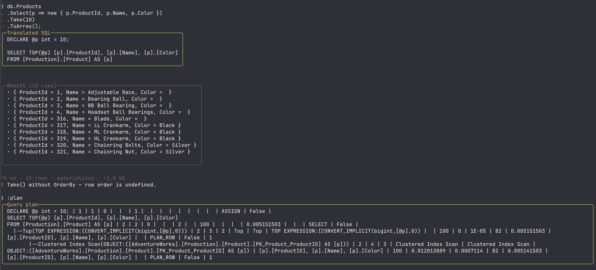
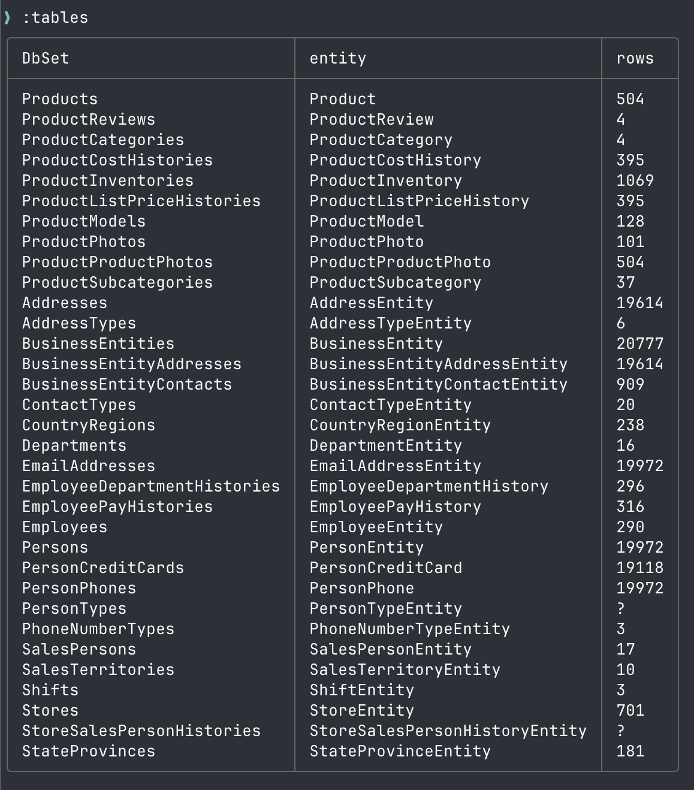
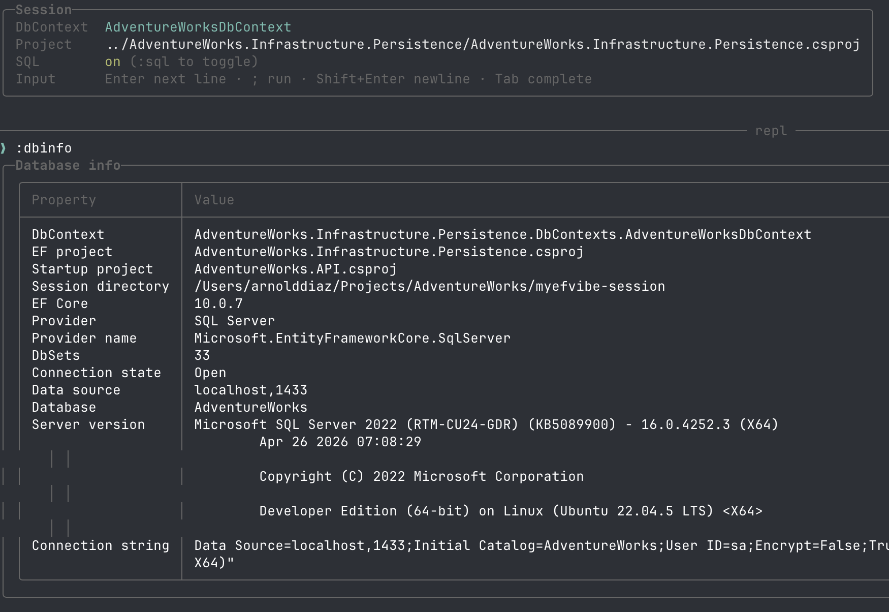
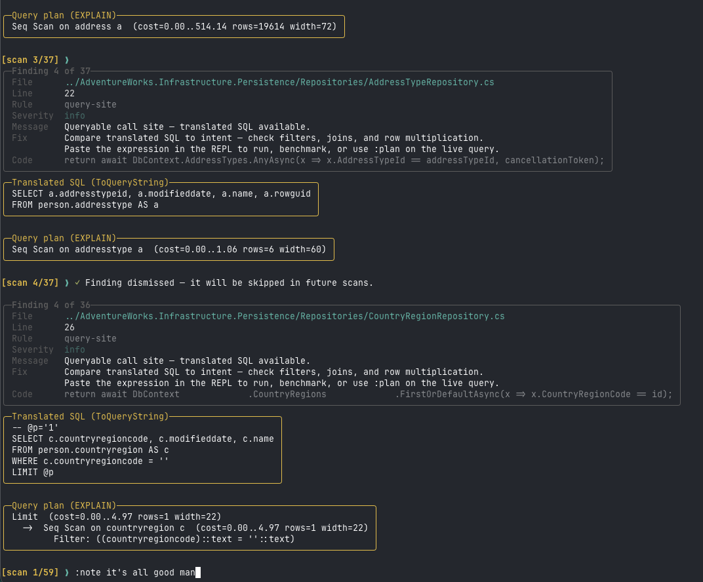
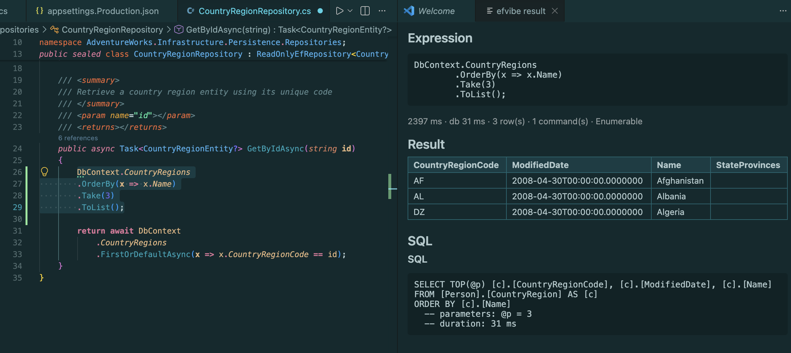
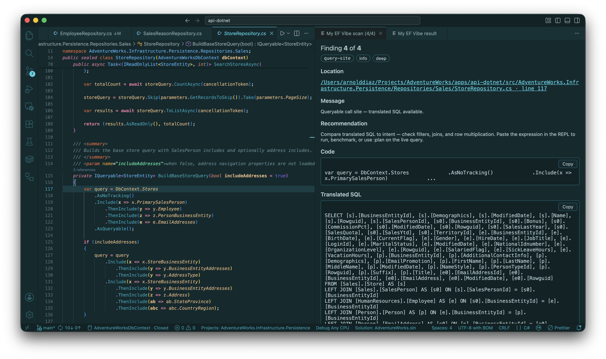

# MyEfVibe

**Website:** [myefvibe.com](https://myefvibe.com/) · **Docs:** [myefvibe.com/docs](https://myefvibe.com/docs/) · *
*GitHub:** [yeahbah/my-ef-vibe](https://github.com/yeahbah/my-ef-vibe) · **NuGet:
** [efvibe](https://www.nuget.org/packages/efvibe)

Interactive CLI to run LINQ against an external .NET project's EF Core `DbContext`.

**Works with most EF Core relational providers** — SQL Server, PostgreSQL, SQLite, Oracle, MySQL/MariaDB, Firebird, **Couchbase** (async LINQ),
and other packages discovered from your EF project's `PackageReference` entries. See
[docs/database-providers.md](docs/database-providers.md).

Point `efvibe` at your solution, get a REPL with **`db`** (your `DbContext`) in scope, see translated SQL,
execution metrics, and helpers like `:tables`, `:describe`, `:dbinfo`, `:plan`, `:stats`, `:scan lite`, and
`:scan deep`.

Requires [.NET 8 SDK](https://dotnet.microsoft.com/download) or newer (tool ships `net8.0`, `net9.0`, and `net10.0`
assets).

## Screenshots

Startup banner, session panel, and a LINQ query with translated SQL, results, and `:plan`:



`:tables` — DbSets and entity types:



`:dbinfo` — provider, connection, and startup project details:



`:scan deep` — review queue with translated SQL and EXPLAIN query plans per call site (saved to
`myefvibe-scan-deep.json`):



VS Code extension — install from
the [Marketplace](https://marketplace.visualstudio.com/items?itemName=yeahbah.vscode-efvibe) (search **`efvibe`**). *
*Run Selection** via `efvibe serve`, result panel, multi-cell `.efvibe-notebook` files, **efvibe Session** sidebar, *
*Scan Review**
carousel ([vscode-extension/README.md](vscode-extension/README.md) · [docs on myefvibe.com](https://myefvibe.com/docs/vscode.html)):





Rider extension — install from the [JetBrains Marketplace](https://plugins.jetbrains.com/plugin/31961-my-ef-vibe) (
search **`My EF Vibe`**). Per-project settings, `efvibe serve` daemon, terminal REPL, Run Selection, model actions, scan
review, notebooks, and a structured tool
window ([rider-extension/README.md](rider-extension/README.md) · [docs/rider-extension.md](docs/rider-extension.md)):

## Install

From NuGet (when published):

```bash
dotnet tool install --global efvibe
```

From a local build:

```bash
dotnet pack src/MyEfVibe/MyEfVibe.csproj -c Release -o ./artifacts
dotnet tool install --global efvibe --add-source ./artifacts
```

### Local tool (per repository)

Restore the pinned tool after cloning:

```bash
dotnet tool restore
efvibe -w ./myefvibe-session
```

Update [`.config/dotnet-tools.json`](.config/dotnet-tools.json) when releasing a new version.

## Quick start

Run from your solution root (where `.csproj` files live):

```bash
efvibe
```

Session artifacts default to **`~/.efvibe/<ProjectName>/<DbContextName>/`** (macOS/Linux) or
`%APPDATA%\efvibe\<ProjectName>\<DbContextName>\` (Windows). Override the root with `-w`:

```bash
efvibe -w ./myefvibe-session
# → ./myefvibe-session/AdventureWorks.Infrastructure.Persistence/AdventureWorksDbContext/
```

| Flag                      | Role                                                                                                                        |
|---------------------------|-----------------------------------------------------------------------------------------------------------------------------|
| `-w`, `--workspace`       | **Workspace root** — `<ProjectName>/<DbContextName>/` under this path (optional; default `~/.efvibe` or `%APPDATA%\efvibe`) |
| `-p`, `--project`         | **EF project** to build — the `.csproj` that contains (or references) the `DbContext`; also the source of truth for **which EF provider package** to wire up |
| `-s`, `--startup-project` | **Config project** — user secrets and `appsettings` (like `dotnet ef --startup-project`)                                    |

If `-p` is omitted, projects are discovered under the **current directory** (not `-w`). If `-s` / `--startup-project` is
omitted, `efvibe` infers a project that references the EF project and has user secrets or appsettings.

In the REPL, query with `db` (for example `db.Products.Take(5).ToList();`). **Couchbase** sessions require async terminals (`await db.Products.Take(5).ToListAsync();`). End input with `;` to run. Use `:help` for
all commands, `:about` for version and session info.

**Explore the model**

| Command             | Purpose                                                                                       |
|---------------------|-----------------------------------------------------------------------------------------------|
| `:tables`           | List DbSets and entity types                                                                  |
| `:describe Product` | Entity properties (types, PK/FK, columns)                                                     |
| `:dbinfo`           | Provider, connection string, server version                                                   |
| `:tracked`          | Change tracker summary                                                                        |
| `:scan lite`        | Static LINQ scan; step through findings in a review queue                                     |
| `:scan deep`        | Lite rules + `ToQueryString()` SQL + `EXPLAIN` per call site (live `db`; requires connection) |

One-shot:

```bash
efvibe -w ./myefvibe-session -e "db.Products.Count();"
```

### Class library + API (recommended pattern)

DbContext in persistence, connection string on the API:

```bash
efvibe -w ./myefvibe-session \
  -p ./apps/api-dotnet/src/AdventureWorks.Infrastructure.Persistence/AdventureWorks.Infrastructure.Persistence.csproj \
  -s ./apps/api-dotnet/src/AdventureWorks.API/AdventureWorks.API.csproj \
  -c AdventureWorksDbContext
```

`-s` / `--startup-project` is often optional when the API references the persistence project.

Local development without installing the tool:

```bash
dotnet run --project src/MyEfVibe/MyEfVibe.csproj -f net10.0 -- \
  -w ./myefvibe-session \
  -p ./apps/api-dotnet/src/AdventureWorks.Infrastructure.Persistence/AdventureWorks.Infrastructure.Persistence.csproj \
  -s ./apps/api-dotnet/src/AdventureWorks.API/AdventureWorks.API.csproj \
  -c AdventureWorksDbContext
```

## Database providers

efvibe auto-discovers the EF provider from **`PackageReference` entries on `-p`** (including referenced projects).
Reference exactly one relational provider package on `-p`.

| Tier | Providers | What you get |
|------|-----------|--------------|
| **Full** | SQL Server, PostgreSQL, SQLite, Oracle, MySQL/MariaDB | DbContext construction, LINQ REPL, SQL translation, `:plan` (where supported); PostgreSQL/SQLite also get naming customizers |
| **Generic** | Any other `*.EntityFrameworkCore.*` package (e.g. Firebird) | DbContext construction, LINQ REPL, SQL translation |

Pass `--connection-string` to override config from `-s` (provider is still discovered from `-p`). `:dbinfo` shows the
resolved provider package and feature tier.

Full reference: [docs/database-providers.md](docs/database-providers.md). Cosmos DB and InMemory are not supported through
the relational auto-construct path.

## macOS and SQL Server

SQL Server is not Windows-only for development. On macOS (and Linux), run **SQL Server in Docker** and connect with
a SQL Server provider package on `-p`. The tool loads the Unix `Microsoft.Data.SqlClient` runtime from the
workspace `.deps.json` (not the portable `lib/` assembly) and normalizes common local connection strings (for example
`Encrypt=False` and stripping `Trusted_Connection` when SQL credentials are present).

Typical issues:

| Symptom                                                                                               | Cause / fix                                                                                                                                                                                                                                                                                                       |
|-------------------------------------------------------------------------------------------------------|-------------------------------------------------------------------------------------------------------------------------------------------------------------------------------------------------------------------------------------------------------------------------------------------------------------------|
| `The target principal name is incorrect` / `Cannot generate SSPI context`                             | Wrong config source — use `-s` for the API (not the persistence library). macOS needs SQL auth in user secrets/appsettings, not Windows integrated security.                                                                                                                                                      |
| `SqlClient is not supported on this platform`                                                         | Old `efvibe` build; use a current build with RID-aware dependency loading.                                                                                                                                                                                                                                        |
| `Unable to load shared library 'e_sqlite3'` / `libe_sqlite3.dylib` (no such file)                     | SQLite native runtime not in the EF library `bin/`; use a current `efvibe` build (loads `runtimes/osx-*/native/libe_sqlite3.dylib` from `.deps.json`). Rebuild/reinstall the tool after updating.                                                                                                                 |
| SQLite Error 14: `unable to open database file`                                                       | Relative `Data Source=Source/...` from user secrets or `appsettings.json` — efvibe resolves it from the startup project upward (same idea as AdventureWorks `SqliteConnectionStringResolver`). Prefer an absolute path in `appsettings.Development.json`, or pass `--connection-string` with the full `.db` path. |
| `LocalAppContextSwitches` / `ConfigurationManager` errors                                             | Host/tool vs workspace assembly conflict; fixed in recent builds (workspace deps preload).                                                                                                                                                                                                                        |
| `Method not found: JsonSerializerOptions.get_Web` / incompatible `System.Text.Json` already in memory | An older `System.Text.Json.dll` (project `bin` or tool folder) loaded before the .NET shared-framework copy. **Exit efvibe and start a new process** — assemblies are not unloaded between REPL commands. Update/reinstall efvibe, rebuild with `-f net8.0`, and delete stray `bin/**/System.Text.Json.dll`.      |
| `:plan` — `SET SHOWPLAN` batch error                                                                  | SQL Server requires `SET SHOWPLAN_ALL` in its own batch; fixed in recent builds.                                                                                                                                                                                                                                  |
| `System.Diagnostics.DiagnosticSource` version 9.0.0 / 10.0.0 not found                                | Transitive NuGet pulls multiple versions; use a current `efvibe` build (version-aware `.deps.json` loading). If it persists, run the tool on the same band as your app, e.g. `dotnet efvibe -f net8.0` from a repo with `dotnet-tools.json`.                                                                      |

For greenfield Mac work without Docker, use a project with `Microsoft.EntityFrameworkCore.Sqlite` or `Npgsql.EntityFrameworkCore.PostgreSQL` on `-p`, or pass `--connection-string` with a SQLite/PostgreSQL connection string.

## Projects and configuration

`efvibe` builds the **EF project** (`-p`) and loads assemblies from its output and `.deps.json`, including **class
libraries** that do not copy EF/SqlClient into `bin/`.

Configuration (connection strings) always comes from the **startup project** (`-s` / `--startup-project`, or
auto-inferred), not from the EF library — same split as `dotnet ef`.

DbContext construction (in order):

1. `IDesignTimeDbContextFactory<T>`
2. Parameterless constructor
3. User secrets on the startup project, then `appsettings*.json` next to that project
4. `--connection-string` (provider discovered from `-p`)

When you do not pass `--connection-string`, efvibe discovers the EF provider from **`PackageReference` entries on `-p`** (including referenced projects). Reference exactly one relational provider package on `-p`.

User secrets use flat keys such as `ConnectionStrings:DefaultConnection` in
`~/.microsoft/usersecrets/<UserSecretsId>/secrets.json`.

`:export csv` / `:export json` writes under `<ProjectName>/<DbContextName>/`; optional paths are relative to that
folder.

### Session files (`<ProjectName>/<DbContextName>/`)

| File                            | Purpose                                                                                                                                                         |
|---------------------------------|-----------------------------------------------------------------------------------------------------------------------------------------------------------------|
| `myefvibe-scan-lite.json`       | Last `:scan lite` results                                                                                                                                       |
| `myefvibe-scan-deep.json`       | Last `:scan deep` results — heuristics, `translatedSql`, `queryPlan` / `queryPlanNote` per finding, plus scan stats (`sqlTranslatedCount`, `queryPlanCount`, …) |
| `myefvibe-scan-dismissals.json` | Dismissed findings (skipped on future scans)                                                                                                                    |
| `myefvibe-scan-notes.json`      | Saved notes on findings (shown on next scan, highlighted in yellow)                                                                                             |
| `myefvibe-export-*.csv/json`    | `:export` output                                                                                                                                                |
| `.build/`                       | Isolated `dotnet build` binary output used by efvibe so Visual Studio and the developer's normal `bin` folders are not locked                                   |

During **scan review**, on an empty prompt: **→** / **←** next/prev, **Del** dismiss, plus `:dismiss`, `:note <text>`,
`:repeat`, `:end`.

## REPL reference

The scripting global is **`db`** (not `dbContext`). Full command list, charts, benchmarks, and export options are
in [features.md](features.md).

Highlights:

- **`:describe <entity>`** (`:desc`) — property sheet for an entity (`Product`, `AddressEntity`, DbSet name `Products`,
  or full type name). Shows CLR types (including arrays such as `byte[]`); adds PK, FK, column name, and max length when
  EF model metadata is available.
- **`:dbinfo`** — DbContext type, EF/Core version, provider, **EF provider package**, **feature tier**, connection state, connection string, and server version.
- **`:plan`** — execution plan for the last translated SQL when the active provider supports it; unknown providers get a clear message instead of failing the session.
- **`:scan lite`** / **`:scan deep`** — project-wide LINQ scan with a review queue, **Fix** hints, **Translated SQL**
  and **Query plan (EXPLAIN)** on deep scan (same engine as `:plan`), `:dismiss`, and `:note`. Deep results persist in
  `myefvibe-scan-deep.json`.
- **`:about`** — tool version, license, and session paths.

## Documentation

| Resource                    | Link                                                                                     |
|-----------------------------|------------------------------------------------------------------------------------------|
| **Product site**            | [myefvibe.com](https://myefvibe.com/)                                                    |
| **Getting started**         | [myefvibe.com/docs/getting-started.html](https://myefvibe.com/docs/getting-started.html) |
| **REPL commands**           | [myefvibe.com/docs/repl.html](https://myefvibe.com/docs/repl.html)                       |
| **LINQ scan**               | [myefvibe.com/docs/scan.html](https://myefvibe.com/docs/scan.html)                       |
| **VS Code extension**       | [myefvibe.com/docs/vscode.html](https://myefvibe.com/docs/vscode.html)                   |
| **Rider extension**         | [docs/rider-extension.md](docs/rider-extension.md)                                       |
| **Visual Studio extension** | [docs/visual-studio-extension.md](docs/visual-studio-extension.md)                       |

| Doc (repository)                                                             | Description                                                                                                                      |
|------------------------------------------------------------------------------|----------------------------------------------------------------------------------------------------------------------------------|
| [features.md](features.md)                                                   | Full REPL and CLI reference                                                                                                      |
| [docs/database-providers.md](docs/database-providers.md)                     | Multi-provider support — discovery, feature tiers, and limits                                                      |
| [vscode-extension/INSTALL.md](vscode-extension/INSTALL.md)                   | Install the VS Code extension ([Marketplace](https://marketplace.visualstudio.com/items?itemName=yeahbah.vscode-efvibe) or VSIX) |
| [vscode-extension/README.md](vscode-extension/README.md)                     | VS Code extension (run selection, `efvibe serve`, scan review, editable panel)                                                   |
| [rider-extension/README.md](rider-extension/README.md)                       | Rider extension MVP (Gradle plugin, settings, actions, tool window)                                                              |
| [docs/rider-extension.md](docs/rider-extension.md)                           | Step-by-step Rider plugin setup and usage guide                                                                                  |
| [docs/visual-studio-extension.md](docs/visual-studio-extension.md)           | Visual Studio 2022 extension MVP (VSIX setup, commands, verification)                                                            |
| [docs/vscode-extension-plan.md](docs/vscode-extension-plan.md)               | VS Code extension roadmap (phases, CLI hooks, diagnostics)                                                                       |
| [docs/efvibe-daemon-and-vscode.md](docs/efvibe-daemon-and-vscode.md)         | `efvibe serve` daemon — fast Run Selection in VS Code                                                                            |
| [docs/visual-studio-extension-plan.md](docs/visual-studio-extension-plan.md) | Visual Studio 2022+ extension roadmap (VSIX, Error List, tool windows)                                                           |
| [docs/rider-extension-plan.md](docs/rider-extension-plan.md)                 | JetBrains Rider plugin roadmap (inspections, tool windows)                                                                       |
| [docs/linq-scan-feasibility.md](docs/linq-scan-feasibility.md)               | How project LINQ scanning works                                                                                                  |

## License

Licensed under the [Apache License, Version 2.0](LICENSE).

The open source CLI is free to use under Apache 2.0. See [features.md](features.md) for the full command reference.

## Publishing

Every push to `main` runs CI (including VS Code, Visual Studio, and Rider extension package checks), then automatically:

1. Computes the next patch version (max of latest `v*` git tag, NuGet, `.csproj`, and `vscode-extension/package.json`)
2. Creates and pushes a `v*` tag (e.g. `v0.1.4`)
3. Publishes that version to [NuGet](https://www.nuget.org/packages/efvibe), packages the **VS Code extension** and *
   *Visual Studio extension** as `.vsix` files, packages the **Rider extension** as a JetBrains plugin `.zip`, opens a
   GitHub Release with all assets, and (when secrets are set) publishes the VS Code package to
   the [Visual Studio Marketplace](https://marketplace.visualstudio.com/items?itemName=yeahbah.vscode-efvibe)
   and [Open VSX](https://open-vsx.org/), and the Rider plugin to
   the [JetBrains Marketplace](https://plugins.jetbrains.com/plugin/31961-my-ef-vibe)

Set the repository secret **`NUGET_API_KEY`** ([nuget.org API key](https://www.nuget.org/account/apikeys)) for publish
to work.

Optional secrets for extension marketplaces (skipped when unset):

| Secret          | Purpose                                                                                                                                                                       |
|-----------------|-------------------------------------------------------------------------------------------------------------------------------------------------------------------------------|
| `OVSX_PAT`      | [Open VSX](https://open-vsx.org/) — token from your publisher account                                                                                                         |
| `VSCE_PAT`      | [Visual Studio Marketplace](https://marketplace.visualstudio.com/) — Azure DevOps PAT with **Marketplace (Publish)** scope                                                    |
| `PUBLISH_TOKEN` | [JetBrains Marketplace](https://plugins.jetbrains.com/plugin/31961-my-ef-vibe) — personal access token from **Account Settings → My Tokens** (plugin id `com.yeahbah.efvibe`) |

**Install the extension:** Extensions → search **`efvibe`** → **My EF Vibe
** ([yeahbah.vscode-efvibe](https://marketplace.visualstudio.com/items?itemName=yeahbah.vscode-efvibe)), or
`code --install-extension yeahbah.vscode-efvibe`. For offline or pre-release builds, use a `.vsix`
from [GitHub Releases](https://github.com/yeahbah/my-ef-vibe/releases) (
see [vscode-extension/INSTALL.md](vscode-extension/INSTALL.md)).

Manual publish: **Actions → Publish → Run workflow** (optional version input), or push a tag:

```bash
git tag v0.1.5 && git push origin v0.1.5
```

Version-bump commits from CI include `[skip ci]` so they do not trigger another release.

## Contributing

Contributions welcome via pull request. By contributing, you agree that your
contributions are licensed under the Apache License 2.0.
