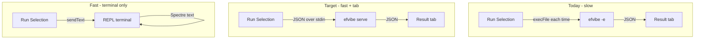

# efvibe daemon vs one-shot (VS Code performance)

**Website:** [myefvibe.com](https://myefvibe.com/) · **VS Code guide:** [myefvibe.com/docs/vscode.html](https://myefvibe.com/docs/vscode.html)

## Why one-shot Run Selection was slow

**Before `efvibe serve`, each Run Selection started a new process**, which **built the EF project, loaded the workspace host, created the `DbContext`, evaluated once, and exited**. That was much slower than an interactive REPL where build and connection stay warm.

**VS Code v0.5.0+** uses `efvibe serve` by default (`efvibe.useDaemon`: true). Set `efvibe.useDaemon`: false to restore per-run `efvibe -e` one-shot behavior.

**Scan Review** runs `efvibe scan` headless and opens a carousel tab for findings — separate from the result panel used for Run Selection.

| One-shot (`efvibe -e "…"`) | Interactive REPL (`efvibe`) |
|----------------------------|-----------------------------|
| New process every time | One process |
| Full `dotnet build` + load each run | Build once at start |
| DbContext created each run | Same `db`, same connection |
| JSON to extension via stdout | You type in the terminal |

The VS Code panel path uses `execFile` with `-e --format json` — it does not talk to an already-running REPL.

## Forwarding selection to the REPL terminal

You *could* send the snippet into an open **efvibe** terminal (`terminal.sendText(...)`). That would be faster for execution, but:

- **Results land in the terminal** (Spectre tables, SQL blocks) — not structured JSON.
- The **split result tab would stop working** unless you scrape terminal output, which the project deliberately avoids (fragile vs `--format json`).
- The REPL today is **interactive** (`QueryRepl` + `ReplLineReader` prompts), not a “send one line, get one JSON blob” pipe.

**Terminal reuse = faster queries, terminal UX only** (unless the CLI gains a machine protocol).

## What a daemon requires

A **daemon** means: **one long-lived `efvibe` process** the extension talks to over **stdin/stdout**, with a **stable JSON contract** — same payload as today’s `-e --format json`, but without restarting.

### CLI

```text
efvibe serve
  → read line-delimited JSON requests from stdin
  → write line-delimited JSON responses to stdout
```

Example messages:

```json
{ "type": "init", "project": "...", "startupProject": "...", "context": "..." }
{ "type": "eval", "expression": "db.Products.Take(5).ToList()", "withPlan": false }
```

- **Init once:** build, load `WorkspaceHost`, open `DbContext`.
- **Eval many times:** reuse `ScriptSession` + `db` (same as REPL loop, without Spectre UI).

Optional: `ping`, `shutdown`, `plan` (or `withPlan` on eval).

### VS Code extension

| Piece | Role |
|--------|------|
| Process manager | Start `efvibe serve` on first Run; one process per workspace profile |
| Transport | JSON lines to stdin; JSON lines from stdout |
| Lifecycle | Restart daemon when settings change; handle crash/timeout |
| UI | Unchanged — result panel uses same `EvaluationJsonPayload` |
| Start REPL | Optional separate terminal for humans (`:tables`, `:scan`, etc.) |

A daemon does **not** force results into the terminal. The panel keeps working; only the backend changes.

## Architecture options



## Recommendation

1. **Short term:** Use **Start REPL** for iterative work; Run Selection for occasional checks.
2. **Right fix:** **`efvibe serve`** + extension process manager — fast runs **and** result tab.
3. **Partial help:** `--no-build` on `-e` when artifacts are fresh — still pays process + DbContext per run.

## Implementation status

- **CLI:** `efvibe serve` — `ServeCommandRunner`, `ServeProtocol`, `WorkspaceRuntimeBootstrap`
- **Protocol:** line-delimited JSON on stdin; first stdout line `{"type":"ready",...}`; eval returns same JSON as `-e --format json`
- **VS Code v0.2.2:** `daemonClient.ts` — `efvibe.useDaemon` (default `true`); falls back to one-shot `efvibe -e` if serve is missing or fails

### Serve usage (manual)

```bash
efvibe serve -p ./MyApp.Data.csproj -s ./MyApp.Api.csproj -c AppDbContext
# stdout: {"type":"ready","dbContext":"AppDbContext",...}
# stdin:
{"type":"eval","expression":"db.Products.Count()"}
{"type":"eval","expression":"db.Products.Take(5).ToList()","withPlan":true}
{"type":"shutdown"}
```

## Related

- [myefvibe.com](https://myefvibe.com/) — product site and guides
- [vscode-extension-plan.md](./vscode-extension-plan.md) — Phase 3B language-server / long-running process
- [vscode-extension/README.md](../vscode-extension/README.md) — `efvibe.useDaemon` setting
