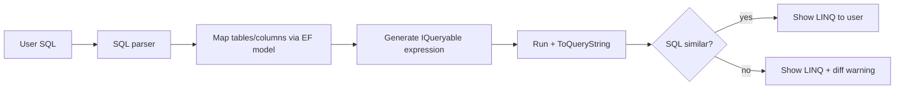

# Plan: Standalone efvibe IDE

A dedicated desktop app for EF Core LINQ exploration — not another editor plugin. The **efvibe CLI remains the evaluation engine**; the IDE is orchestration, UX, and multi-project workspace management.

---

## Vision

**efvibe Studio** (working name): a LINQPad-style environment built specifically for EF Core — live `db` context, translated SQL, query plans, scan review, and session analytics — with first-class support for **multiple solutions/projects** in one window.

| Plugin today | Standalone IDE |
|---|---|
| One Rider/VS Code project at a time | Many projects/connections in one workspace |
| Tool window bolted onto an IDE | Purpose-built layout (editor + results + schema + scan) |
| Depends on host editor for navigation | Built-in source browser + optional “open in IDE” |
| Per-project settings in `.idea` / VS Code config | Portable `.efvibe-workspace` file |

---

## Architecture

Keep the split you already have: **UI shell ↔ `efvibe serve` daemons ↔ Roslyn/EF workspace host**.


### Design principles

1. **No rewrite of evaluation** — all runs go through existing JSON protocols (`eval`, `scan`, `dbinfo`, `tables`, etc.).
2. **One daemon per active connection** — warm builds, fast repeat runs (same as Rider/VS Code today).
3. **Lazy daemon startup** — spin up on first run; idle timeout or manual disconnect.
4. **Portable workspace format** — versioned JSON/YAML describing projects, connections, and UI state.
5. **Cross-platform** — Linux, macOS, Windows from day one.

### Recommended tech stack

| Layer | Recommendation | Why |
|---|---|---|
| Shell | **Tauri 2** or **Avalonia** | Native feel, smaller than Electron; C# team already owns the engine |
| Editor | **Monaco** or **AvaloniaEdit** + Roslyn bridge | Reuse patterns from `vscode-extension` / Rider plugin |
| Protocol | stdin/stdout JSON lines (existing `serve`) | Zero migration cost |
| State | SQLite + workspace files on disk | Session history, scan dismissals, favorites |
| Packaging | Bundled `efvibe` binary + optional “use system dotnet tool” | Same model as editor extensions |

### Tauri vs Avalonia

| | **Tauri** | **Avalonia** |
|---|---|---|
| Primary languages | TS/JS + Rust | C# |
| UI paradigm | Web components | XAML controls |
| Cross-platform | Yes (WebView + Rust) | Yes (Skia rendering) |
| Reuse from VS Code extension | High | Low–medium |
| Reuse from Rider plugin | Low (Kotlin/Swing) | Medium (desktop patterns) |
| Calling `efvibe` CLI | Rust `Command` or shell out | `Process` in C# |
| Rich text / code editor | Monaco is trivial | AvaloniaEdit or embedded webview |
| Performance for big result grids | Good with virtualized web tables | Good with native grids |
| Team skill match (.NET shop) | Need TS + some Rust | Mostly C# |
| Maturity for “custom IDE” | Many examples (web IDEs) | Fewer, but solid for desktop apps |

- Choose **Tauri** for fastest path to a VS Code–like experience (Monaco, port `daemonClient.ts` / `resultPanel.ts`).
- Choose **Avalonia** for a single-stack C# desktop app and a more traditional native IDE feel.

### Platform options: SharpIDE fork vs greenfield

[SharpIDE](https://github.com/MattParkerDev/SharpIDE) is an open-source, cross-platform .NET IDE (MIT, .NET 10, Godot 4) with Roslyn completions, build/run/debug, solution picker, and a layered `SharpIDE.Application` + `SharpIDE.Godot` architecture. It is a credible alternative to building editor plumbing from scratch — but a **full fork is not the recommended default**.

#### What SharpIDE provides

| Already built | Relevance to efvibe Studio |
|---|---|
| Roslyn completions, signature help, refactorings | Strong for editing **project source** (`.cs` files) |
| Build / run / debug (SharpDbg, netcoredbg) | Strong for “open solution and work” |
| Solution picker, file tree, go-to-definition, decompile | Strong for scan “go to code” |
| `SharpIDE.MsBuildHost` | Overlaps with efvibe’s `dotnet build`, but more IDE-native |
| `SharpIDE.Application` feature modules | Potential host for efvibe integration logic |
| Cross-platform releases (Linux/macOS/Windows) | Matches Studio goals |

Rough architecture:

```
Godot UI (scenes, editor, panels)
    ↕
SharpIDE.Application (Roslyn, Build, Run, Debug, Evaluation, …)
    ↕
MSBuild host / debugger processes
```

#### Where SharpIDE does not map cleanly

efvibe Studio is primarily a **LINQ/EF execution environment**, not a general code editor.

**1. Two different Roslyn worlds**

| Context | What IntelliSense needs |
|---|---|
| SharpIDE project editor | Solution/project analysis (`db` does not exist) |
| efvibe query editor | Scripting session with live `db`, DbSets, entity types from loaded workspace |

SharpIDE’s Roslyn stack does not automatically provide `db.Products.` completions in a query tab. That still requires **`efvibe serve`** (or direct `MyEfVibe` integration).

**2. Godot cost**

- Development flows through the **Godot Editor** and scene files (`IdeRoot.tscn`)
- UI work is Godot nodes/scenes, not XAML or web components
- Bundles are large (~85–170 MB per release)
- Project is explicitly **WIP** (NuGet UI, test explorer, debugger edge cases)

**3. Fork maintenance**

Upstream moves quickly (frequent releases). A full fork implies ongoing merge pain or falling behind fixes.

**4. Product identity**

Forking SharpIDE positions the product as **“another C# IDE with an efvibe panel”** rather than **“LINQPad for EF Core”**.

#### Strategy comparison

| Approach | When it makes sense |
|---|---|
| **Full fork of SharpIDE** | General .NET IDE first, efvibe second |
| **Greenfield Studio (Tauri/Avalonia)** | EF/LINQ-first product (default recommendation) |
| **Hybrid** | Focused Studio + optional IDE integration or upstream panel |

**Recommendation: hybrid, not full fork.**

- **SharpIDE / Rider / VS Code** → editing and navigating `.cs` project code
- **efvibe Studio** → running LINQ against live `db`, SQL, plans, scan, notebooks, multi-connection workspaces

#### Three practical options

**Option A — efvibe Studio + “Open in IDE” (lowest risk, default)**

- Build the focused Studio from this plan (Tauri or Avalonia)
- Scan “go to code” opens SharpIDE, Rider, or VS Code via file path + line
- No fork, no Godot dependency

**Option B — efvibe panel inside SharpIDE (medium risk)**

- Contribute or maintain an **efvibe tool panel** in SharpIDE (MIT allows this)
- Panel talks to `efvibe serve` like the Rider extension
- Upstream owns editor/build/debug; efvibe owns EF query UX
- Requires Godot UI work and coordination with upstream

**Option C — Reuse `SharpIDE.Application` only (medium-high risk)**

- Do not fork the Godot shell
- New shell (Photino, Tauri, or Avalonia) hosts query/result UI
- Borrow MSBuild/Roslyn patterns from `Features/Analysis`, `MsBuildHost` where useful
- Avoids Godot; still significant integration work

#### SharpIDE spike checklist (1–2 days, before Phase 0 commit)

Run this before locking the shell decision:

1. Clone [SharpIDE](https://github.com/MattParkerDev/SharpIDE), build per `CONTRIBUTING.md` (.NET 10 SDK + Godot 4.5+)
2. Open a solution with an EF Core project; verify completions, build, run, debug
3. Inspect `src/SharpIDE.Application/Features/Evaluation` for overlap with scratchpad/query eval
4. Sketch a bottom or side panel that spawns `efvibe serve` and renders evaluation JSON
5. Measure friction: Godot scene edits, panel layout, daemon lifecycle, go-to-code from scan
6. **Decision gate:**
   - Low friction → consider Option B (upstream panel or fork branch `efvibe-studio`)
   - High friction → proceed Option A (greenfield Tauri/Avalonia)

#### Decision record (fill after spike)

| Criterion | Greenfield (Tauri/Avalonia) | SharpIDE fork/panel |
|---|---|---|
| Time to efvibe feature parity | Faster for query/result/scan UX | Slower (Godot + IDE surface) |
| `db.*` completions in query editor | Via `efvibe serve` either way | Via `efvibe serve` either way |
| Project `.cs` editing | Defer or “open in IDE” | Built-in |
| Team skills | TS/Rust or C#/XAML | C# + Godot |
| Bundle size | Smaller | Larger |
| Maintenance | Self-contained | Upstream dependency |

---

## Multi-project workspace model

This is the main reason to build a standalone IDE.

### Concepts

```
efvibe Workspace (.efvibe-workspace)
├── Projects[]          # registered .csproj roots (solutions optional)
│   ├── AdventureWorks.API
│   └── AdventureWorks.Infrastructure.Persistence
├── Connections[]       # runnable EF sessions
│   ├── { id, efProject, startupProject, context, connectionOverride?, provider? }
│   └── ...
├── Queries[]           # .efvibe-query files (tabs)
├── Notebooks[]         # .efvibe-notebook files
└── Settings            # theme, daemon policy, export paths
```

### Connection = what plugins call “session settings”

Each connection maps 1:1 to today’s CLI flags:

| Field | CLI flag |
|---|---|
| EF project | `-p` |
| Startup project | `-s` |
| DbContext | `-c` |
| Connection override | `--connection-string` |
| Framework | `--framework` |
| Workspace root | `-w` (per-connection subfolder) |

A single EF project can expose **multiple connections** (e.g. `AppDbContext` vs `ReadOnlyDbContext`, or dev vs staging connection string).

### UI affordances

- **Connection picker** in toolbar (LINQPad-style dropdown).
- **Colored tab badges** showing active connection.
- **Connection sidebar**: status (building / ready / error), provider, database name, last build time.
- **“Open folder”** adds a project; **“Add connection wizard”** auto-discovers `.csproj` + DbContexts (reuse existing discovery logic from CLI).
- **Recent connections** across workspaces.

---

## Feature parity with plugins (must-have v1)

Everything from Rider + VS Code extensions should land in v1.

### Query execution

| Feature | Source today |
|---|---|
| Expression editor + Run / Run Plan | Rider tool window, VS Code result panel |
| `efvibe serve` daemon with warmup | `EfvibeDaemonClient`, `daemonClient.ts` |
| Run selection / run line / run statement | VS Code commands |
| Repository snippet normalization | Core REPL pipeline |
| Expression guard (read-only safety) | `ExpressionGuard` |
| Export CSV / JSON | Rider + VS Code |
| Copy SQL / plan blocks | VS Code result panel |

### Results & diagnostics

| Feature | Source today |
|---|---|
| Result grid (tabular) | Rider `Result` tab |
| SQL tab (translated + executed) | Both plugins |
| Query plan tab | Both plugins |
| Messages / warnings footer | Evaluation JSON payload |
| Session info panel | `:dbinfo`, `:stats` equivalents |
| History of evaluations | VS Code `evaluationHistory` |

### Model explorer

| Feature | Source today |
|---|---|
| DbInfo | `--dbinfo-json` |
| Tables list | `--tables-json` |
| Describe entity | describe JSON |
| Run Count / Run Sample on selected DbSet | Rider Model tab |
| Model tree | VS Code `modelTree` |

### Scan

| Feature | Source today |
|---|---|
| Scan lite / deep | CLI `scan` |
| Scan review carousel | VS Code `scanReviewPanel`, Rider Scan tab |
| Dismiss / note persistence | `myefvibe-scan-dismissals.json`, notes files |
| Go to source | Rider `OpenFileDescriptor`; IDE needs own file opener |
| Rule documentation | VS Code `scanRuleDocs` |
| Optional problems/squiggles | VS Code `scanDiagnostics` (can be v1.1) |

### Notebooks

| Feature | Source today |
|---|---|
| Multi-cell runner (`---` separator) | Rider notebook tab |
| Code / Result sub-tabs | Rider notebook tab |
| `.efvibe-notebook` open/save | Rider + VS Code serializer |
| Run all cells | Both |
| Native notebook UX (outputs per cell) | VS Code notebook controller (stretch to v1.1) |

### REPL terminal

| Feature | Source today |
|---|---|
| Full interactive REPL | `Start REPL` action |
| Embedded terminal pane | Rider terminal; VS Code `replTerminal` |
| All `:commands` (`:scan`, `:plan`, `:compare`, etc.) | CLI |

### Prerequisites & tooling

| Feature | Source today |
|---|---|
| Check prerequisites (.NET SDK, efvibe on PATH) | Both plugins |
| Resolved efvibe executable path | Settings |
| Refresh connection / rebuild | `RefreshConnection` |

---

## LINQPad-inspired additions (differentiators)

Pick features that fit EF workflows — not a full LINQPad clone.

### Tier 1 — high value, fits existing engine

| LINQPad idea | efvibe Studio interpretation |
|---|---|
| **Query tabs** | Many `.efvibe-query` files; each tab binds to a connection |
| **Schema browser** | Left sidebar: DbSets → columns/navigations (`:tables` + `:describe` as live tree) |
| **Ctrl+Enter run** | Default keybinding; run current statement or selection |
| **SQL pane** | Split view: LINQ left, generated SQL right (live on idle debounce) |
| **Result explorer** | Tree/grid hybrid for nested objects (biggest UX gap vs LINQPad Dump) |
| **Query folders** | Organize scripts under workspace; tags, favorites, search |
| **Connection manager** | Named connections with env tags (Dev/Staging/Prod) + secret references |
| **Recent & pinned queries** | SQLite index of runs + snippets |
| **Benchmark panel** | Visual wrapper around `:benchmark N` + charts (`:chart`) |
| **Compare runs** | UI for `:compare set` / `:compare` side-by-side |

### Tier 2 — medium effort, strong appeal

| LINQPad idea | efvibe Studio interpretation |
|---|---|
| **My Snippets / Extensions** | User snippet library + shared team packs |
| **#load / additional usings** | Extend scripting globals per connection (Roslyn already supports submissions) |
| **Raw SQL mode** | Separate editor mode using `FromSqlRaw` wrapper or future `efvibe sql` command |
| **Lambda scratchpad** | Small expression-only buffer (no `;` required) |
| **Password / secret vault** | Integrate with OS keychain; map to user-secrets paths |
| **Diff two connections** | Same query against Dev vs Staging (two daemons, diff grid) |
| **Export to GitHub gist / share link** | Query + SQL + plan as markdown bundle |
| **SQL → LINQ** | EF-model-aware converter with validation loop — see below |

### Tier 3 — later / optional

| LINQPad idea | Notes |
|---|---|
| **NuGet references in script** | Possible via Roslyn `#r`; needs careful isolation per connection |
| **C# Program mode** | Full `Main()` scripts — lower priority for EF-focused users |
| **Attach to running app** | Hard; defer unless strong demand |
| **ORM-agnostic ADO** | Out of scope; stay EF Core focused |

---

## SQL → LINQ conversion

efvibe already does **LINQ → SQL** reliably via EF Core `ToQueryString()` and executed SQL capture. **SQL → LINQ** is the inverse problem — EF Core does not provide it, and there is no standard .NET API. A **bounded, EF-model-aware converter** is feasible and fits efvibe Studio well.

### Positioning

Market this as a **draft assistant**, not a universal compiler. Users paste SQL from logs, SSMS, pgAdmin, or a colleague; Studio returns editable LINQ mapped to the active `db` context, then validates by round-tripping through `ToQueryString()`.

### Feasibility tiers

| Tier | SQL shape | Feasibility | Output quality |
|------|-----------|-------------|----------------|
| **A** | `SELECT … FROM one_table WHERE …` | High | Good starter LINQ |
| **B** | Inner joins (2–3 tables), `ORDER BY`, `TOP`/`LIMIT` | Medium | Usable with `join` or navigation properties |
| **C** | `GROUP BY`, aggregates (`COUNT`, `SUM`, …) | Medium | `GroupBy` + projections |
| **D** | Subqueries, CTEs, window functions, `UNION` | Low | Often wrong or unmappable |
| **E** | Provider-specific SQL (hints, dialect-only features) | Very low | Manual rewrite required |

**MVP target:** Tier A–C. Flag Tier D–E sections as unsupported instead of guessing.

### Why efvibe can do this better than generic tools

- Live **`db`** with EF model metadata (`:tables`, `:describe`, `GetEntityTypes`)
- Known **DbContext**, provider, and table→DbSet mapping
- **Validation loop:** run generated LINQ → `ToQueryString()` → diff against original SQL
- Insert result directly into a query tab and execute

### Pipeline



### Implementation approach

**Phase 2a — Rule-based converter (recommended v1)**

1. Parse SQL with a dialect-aware parser (e.g. `Microsoft.SqlServer.TransactSql.ScriptDom` for SQL Server; PostgreSQL/SQLite parsers added per provider priority).
2. Resolve `FROM Products` → `db.Products` using EF metadata (table name, schema, entity CLR name).
3. Emit idiomatic patterns:

   ```csharp
   db.Products
       .Where(p => p.Name.Contains("x"))
       .OrderBy(p => p.Id)
       .Take(10)
       .Select(p => new { p.Id, p.Name })
   ```

4. Mark unsupported nodes (`LEFT JOIN`, subquery in `WHERE`, `WITH` CTE) with inline `// TODO: manual rewrite` comments.
5. Normalize and diff original SQL vs generated `ToQueryString()` output; show confidence badge (high / partial / low).

**Phase 2b — LLM-assisted draft (optional)**

- Use SQL + EF model summary as context to improve join/navigation choices.
- **Always** pass through the validation loop; never present raw model output without a `ToQueryString()` check.

### Studio UX

| Control | Behavior |
|---------|----------|
| **Convert SQL → LINQ** | Paste SQL in SQL pane or dedicated converter dialog |
| **Confidence badge** | High / partial / unsupported regions highlighted in output |
| **Side-by-side diff** | Original SQL vs round-tripped `ToQueryString()` |
| **Insert into query tab** | One click to open draft LINQ for editing and run |
| **Explain only** | For hard SQL, show table→DbSet mapping without full conversion |

Pair with the **SQL pane** (Tier 1): LINQ on the left updates SQL on the right; paste into the right pane and **Convert** flows back to the left.

### CLI surface (engine)

```bash
efvibe sql-to-linq -p ... -c AppDbContext --sql "SELECT ..." --format json --no-banner
```

JSON response shape (sketch):

```json
{
  "linq": "db.Products.Where(...)",
  "confidence": "partial",
  "unsupported": ["LEFT JOIN on Orders"],
  "translatedSql": "SELECT ...",
  "similarity": 0.92,
  "mappings": [{ "table": "Products", "dbSet": "db.Products", "entity": "Product" }]
}
```

`serve` extension (optional): `{"type":"sqlToLinq","sql":"SELECT ..."}` for Studio daemon use.

### User expectations (document clearly)

- Works well for **simple queries against known DbSets**
- **Joins and aggregates** — helpful drafts, often need manual touch-up
- **Complex SQL** — partial conversion + explain mode, not silent magic
- Not a substitute for hand-written production LINQ

### Risks

| Risk | Mitigation |
|------|------------|
| Wrong LINQ silently returned | Mandatory `ToQueryString()` validation + similarity score |
| Multi-dialect parsing cost | Start with active connection’s provider; add dialects incrementally |
| Ambiguous table/column names | Use EF model + schema; ask user to pick when ambiguous |
| Users expect 100% conversion | UI copy and confidence badges set Tier A–C scope |

---

## Proposed UI layout

```
┌─────────────────────────────────────────────────────────────────────────┐
│ File  Edit  Query  Connection  Scan  View  Help          [Connection ▼] │
├──────────┬──────────────────────────────────────────────┬───────────────┤
│          │  Query tabs: *Products.linq  Orders.linq  ... │               │
│ Workspace│──────────────────────────────────────────────│ Schema        │
│          │                                              │ ├ Products    │
│ Projects │  C# Editor (Monaco)                          │ ├ Orders      │
│ ├ API    │  db.Products.Where(...).Take(10).ToList()   │ └ ...         │
│ └ Persist│                                              │               │
│          │──────────────────────────────────────────────│ Model actions │
│ Queries  │  [Run] [Run Plan] [Scan] [Export] [Benchmark]│ Count Sample  │
│ Notebooks│                                              │ Describe      │
│ Scan     ├──────────────────────────────────────────────┤               │
│ History  │ Result | SQL | Plan | Messages | Explorer    │               │
│          │ (grid + object tree)                         │               │
├──────────┴──────────────────────────────────────────────┴───────────────┤
│ Ready · AdventureWorksDbContext · PostgreSQL · 42ms · 1 SQL · 10 rows   │
└─────────────────────────────────────────────────────────────────────────┘
```

**Optional bottom dock**: embedded REPL terminal for power users (`:scan deep`, `:compare`, etc.).

---

## File formats

| Format | Purpose |
|---|---|
| `.efvibe-workspace` | Multi-project workspace manifest |
| `.efvibe-query` | Single script tab (connection id + source + metadata) |
| `.efvibe-notebook` | Existing format — keep compatible |
| Session artifacts | Reuse `~/.efvibe/<Project>/<Context>/` (scan JSON, history, dismissals) |

Example workspace sketch:

```json
{
  "version": 1,
  "name": "AdventureWorks Lab",
  "projects": [
    { "path": "../AdventureWorks/apps/api-dotnet/src/AdventureWorks.API" },
    { "path": "../AdventureWorks/apps/api-dotnet/src/AdventureWorks.Infrastructure.Persistence" }
  ],
  "connections": [
    {
      "id": "aw-pg-dev",
      "name": "AW PostgreSQL (dev)",
      "efProject": "AdventureWorks.Infrastructure.Persistence.csproj",
      "startupProject": "AdventureWorks.API.csproj",
      "context": "AdventureWorksDbContext"
    }
  ]
}
```

---

## Daemon orchestration (multi-project)

| Policy | Behavior |
|---|---|
| **Active connection** | One warm daemon |
| **Background connections** | Optional “keep warm” pin per connection |
| **Memory cap** | LRU eviction of idle daemons (configurable) |
| **Build on save** | Optional file watcher on EF project → `refresh` |
| **Failure recovery** | Show build log panel; one-click retry |

New CLI surface (small additions, not a rewrite):

- `serve --connection-id <id>` for logging
- `workspace validate --json` — verify all connections in a workspace file
- `connections list --json` — discover DbContexts across registered projects
- `sql-to-linq --sql ... --format json` — EF-model-aware SQL → LINQ draft with validation metadata
- Optional `serve` message: `{"type":"sqlToLinq","sql":"..."}`
- Optional: multiplexed `serve` managing multiple contexts in one process (v2 optimization)

---

## Phased delivery

### Phase 0 — Foundation (4–6 weeks)

- **SharpIDE spike** (1–2 days) — complete checklist above; record shell decision
- Desktop shell (Tauri/Avalonia, or SharpIDE panel if spike favors Option B) with Monaco or host editor
- Workspace open/save (`.efvibe-workspace`)
- Single connection: Run, Run Plan, results/SQL/plan tabs
- Daemon client ported from `vscode-extension/src/daemonClient.ts`
- Prerequisites check, settings page
- “Open in IDE” hook for scan go-to-code (SharpIDE / Rider / VS Code)

**Exit criteria:** parity with VS Code result panel for one project; platform decision documented.

### Phase 1 — Multi-project + plugin parity (6–8 weeks)

- Connection manager (add/edit/duplicate connections)
- Multiple query tabs with per-tab connection binding
- Schema explorer + model actions
- Scan lite/deep + review UI
- Notebooks (open/save/run all)
- Embedded REPL terminal
- Session/history sidebar
- Export CSV/JSON

**Exit criteria:** everything in `rider-extension/README.md` Features section works without Rider.

### Phase 2 — LINQPad-style polish (6–10 weeks)

- Result explorer (object tree)
- Live SQL preview pane (bidirectional with SQL → LINQ convert)
- **SQL → LINQ** converter (Tier A–C, validation via `ToQueryString()` diff)
- Query folders, search, favorites
- Benchmark/compare visual panels
- Charts UI (`:chart` wrappers)
- Connection vault / secret profiles
- Themes, keybinding profiles

### Phase 3 — Team & ecosystem (ongoing)

- Shared workspace packs (team query libraries)
- Git integration (commit `.efvibe-query` files)
- “Open in Rider/VS Code” for scan findings
- Optional cloud sync of queries (not DB credentials)
- Marketplace for snippet packs

---

## What to reuse from the repo

| Asset | Reuse strategy |
|---|---|
| `efvibe serve` protocol | Direct — canonical API |
| `vscode-extension/src/*` | Port TypeScript → C#/TypeScript in new shell (daemon, scan, export, notebooks) |
| `rider-extension/.../EfvibeToolWindowPanel.kt` | UX reference for layout and tab structure |
| [SharpIDE](https://github.com/MattParkerDev/SharpIDE) `Application` | Optional: MSBuild host, solution model, project-editor patterns (not a required fork) |
| `features.md` | Command catalog for REPL terminal + roadmap checklist |
| Evaluation JSON schema | Single source of truth for result rendering |
| Session paths (`~/.efvibe/...`) | Unchanged — IDE reads same scan/history files |

---

## Risks and mitigations

| Risk | Mitigation |
|---|---|
| Building another IDE is expensive | Strict engine/UI split; port VS Code extension logic, don’t reinvent |
| Multi-daemon memory use | LRU pool, lazy start, one active connection default |
| No “go to definition” without Roslyn in UI | Phase 1: open file at line in SharpIDE/Rider/VS Code; Phase 3: optional LSP in Studio |
| SharpIDE fork scope creep | Default to greenfield Studio; fork only after spike validates Option B |
| Godot dependency (if SharpIDE path) | Prefer Option A or C over full Godot fork unless panel integration is smooth |
| LINQPad expectations (Dump, NuGet) | Market as **EF Core specialist**, not general C# scratchpad |
| Licensing | Keep engine Apache 2.0; Studio can be commercial with OSS engine; SharpIDE is MIT |

---

## Success metrics

- Open workspace with 3+ projects in under 30 seconds
- Run query → result in <500ms after daemon warm (same as today)
- 100% plugin feature checklist covered by Phase 1
- Users can work a full day across multiple APIs without switching Rider/VS Code windows

---

## Recommended next step

Before writing code, produce a **Phase 0 spec** with:

1. **SharpIDE spike** — complete checklist; choose Option A, B, or C
2. Exact JSON schema for `.efvibe-workspace`
3. Screen wireframes (3: connection manager, query workspace, scan review)
4. Decision record: **Tauri vs Avalonia** (or SharpIDE panel, per spike outcome)
5. Parity checklist copied from `rider-extension/README.md` + `vscode-extension/package.json` commands
