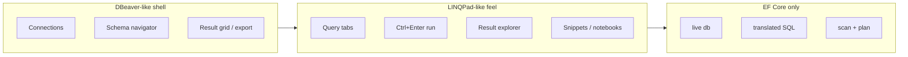
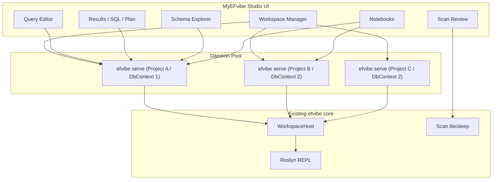
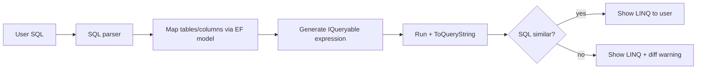

# Plan: MyEFvibe Studio — EF Core database client

A dedicated desktop app for **exploring and querying databases through Entity Framework Core** — the EF-native alternative to [DBeaver](https://dbeaver.io/).

DBeaver is a universal database client: JDBC connections, SQL editor, data grid, metadata browser, DDL tools, and DBA workflows across dozens of providers. **MyEFvibe Studio** occupies the same *job* for EF Core developers — connect, browse schema, run queries, inspect results, export data — but the connection is always **your real `DbContext`**, your build, your LINQ, and the SQL EF actually generates.

The **interaction model** comes from **LINQPad**: fast scratchpad queries, many tabs, Ctrl+Enter run, rich result exploration, snippets, and notebooks — but scoped to EF Core (`db` completions, scan, translated SQL) instead of general C# or ad-hoc SQL.

The **efvibe CLI remains the evaluation engine**; Studio is orchestration, UX, and multi-project workspace management.

Full background: [ef-core-developer-challenges.md](ef-core-developer-challenges.md).

---

## Problem statement

EF Core developers spend their days between **entity classes** and **production incidents** — but everyday tooling splits the problem across tools that do not share context.

| Pain | What goes wrong today | How **efvibe** helps today | How **Studio** extends it |
|------|----------------------|---------------------------|---------------------------|
| **Opaque LINQ** | Deferred execution hides SQL, round-trips, and client eval until runtime | REPL + `ToQueryString()` + executed SQL (`--dblog`); `:plan` for EXPLAIN | SQL pane beside editor; live debounce; query history |
| **Performance footguns** | N+1, unbounded `ToList()`, cartesian `Include`s compile fine | `:scan lite` / `:scan deep` + CI (`efvibe scan`); rule docs with Fix hints | Scan review UI; go-to-source; dismissals synced with CLI |
| **Persistence + API split** | Wrong `-p` / `-s` → wrong secrets, provider, or connection | Auto-discovery; startup project for user secrets / appsettings | Connection wizard; named connections in `.efvibe-workspace` |
| **Provider & naming gaps** | `ProductId` vs `PRODUCTID` vs `product_id`; `smallint` vs `bool` | Naming probes (PostgreSQL, Oracle, SQLite); provider auto-discovery from `-p` | Schema explorer shows **EF model**, not raw catalog; compare Dev vs Staging |
| **Hard to explore through the model** | DBeaver shows tables; IDE shows C# — neither is “live `db`” | `:tables`, `:describe`, `:dbinfo`; Count / Sample from plugins | DbSet tree + model actions; Dump-style result explorer (Phase 2) |
| **Fragmented scratchpad workflow** | LINQPad needs manual context setup; IDE needs run/debug cycle | `efvibe serve` daemon; Rider/VS Code Run Selection | LINQPad-style tabs, Ctrl+Enter, notebooks, snippets — multi-project window |
| **Code-first drift** | Migrations vs manual DB edits; team merge conflicts | — (out of scope) | — (out of scope; use `dotnet ef` / IDE) |
| **Database-first mapping** | Scaffold once, hand-edit forever; legacy schema glue | Run LINQ against real mapped model; see if query translates | SQL → LINQ draft assistant (Phase 2); table→DbSet mapping explain |
| **Test doubles lie** | InMemory / SQLite tests miss provider SQL and types | Run against real provider with project build | Same connection model as prod/staging in workspace |

### By development style

**Code-first teams** own the model in C# but still cannot see what EF emits without running the app, enabling SQL logging, or opening a generic SQL client that ignores conventions and mappings. efvibe closes the loop: build the real project, construct the real `DbContext`, run LINQ, show SQL and plans. Studio makes that loop the primary UI instead of a plugin panel.

**Database-first teams** inherit ugly schemas, casing wars, and mapping glue. DBeaver helps inspect raw tables; it does not show how `db.Products` maps to `production.product` with a `smallint` flag column. efvibe’s naming probes and describe metadata bridge catalog ↔ model. Studio adds side-by-side exploration and (later) SQL-from-logs → LINQ drafts validated via `ToQueryString()`.

**Hybrid / brownfield** is the hardest case: legacy tables plus new migrations, multiple `DbContext`s, raw SQL islands. Generic tools force a choice between SQL-centric (DBeaver) or C#-centric (IDE). efvibe stays on the EF boundary — one engine for REPL, scan, and CI — and Studio unifies multiple connections and query scripts in one workspace.

### What efvibe does *not* solve

Be explicit so scope stays credible:

- **Migrations** — generate, apply, squash, deploy (`dotnet ef`, CI pipelines)
- **Scaffolding** — reverse engineer entities from database
- **DBA operations** — backup, users, index maintenance, DDL authoring
- **General C# scripting** — non-EF scratchpad (use LINQPad or an IDE)

Studio targets the **daily EF loop**: connect with the right project context → explore the model → write LINQ → see SQL and plans → catch smells → export or share results.

---

## Product DNA: DBeaver shell + LINQPad feel

Studio is not “pick one.” It combines what each tool does best for an EF developer:

| Layer | Borrow from | What that means in Studio |
|---|---|---|
| **Workspace & connections** | DBeaver | Connection manager, schema navigator, result grid, export, multi-connection window |
| **Query experience** | LINQPad | Scratchpad editor, query tabs, instant run, selection/statement run, history, folders |
| **Results** | LINQPad | Dump-style object tree + grid (not flat JDBC rows only) |
| **EF-only** | efvibe | Live `db`, `ToQueryString()`, `:plan`, scan, naming probes, project build |



**Analogy:** DBeaver is the *database client* you’d open to poke at Postgres; LINQPad is the *scratchpad* you’d use to try a query in seconds. Studio is both — **if your scratchpad were wired to your app’s `DbContext`**.

---

## Positioning: DBeaver vs MyEFvibe Studio

| | **DBeaver** | **MyEFvibe Studio** |
|---|---|---|
| **Audience** | DBAs, backend devs, data analysts — any SQL database | EF Core developers — one team’s app model |
| **Connection** | JDBC URL, driver, credentials | EF project + startup project + `DbContext` (+ optional connection override) |
| **Primary language** | SQL (plus scripts) | **C# LINQ** against live `db` |
| **Schema view** | Catalog tables, columns, FKs from the server | **EF model** (DbSets, navigations) + live metadata (`:tables`, `:describe`) |
| **Query execution** | Send SQL to the server | Evaluate LINQ → translated SQL (`ToQueryString`) + executed SQL + timings |
| **Query plans** | Provider-specific EXPLAIN on ad-hoc SQL | **`:plan` / deep scan** on the same SQL EF would run from your LINQ |
| **Data editing** | Full grid CRUD on tables | **Read-focused v1**; LINQ mutations possible where safe (expression guard) |
| **Providers** | Universal (MySQL, Postgres, Oracle, …) | **EF relational providers** efvibe already supports (SQL Server, PostgreSQL, SQLite, Oracle, MySQL, Firebird, Couchbase, …) |
| **Code quality** | None | **LINQ scan** (lite/deep), dismissals, notes, CI parity |
| **Multi-database** | Many connections in one UI | Many **connections** (often multiple DbContexts / envs) in one **workspace** |
| **Project context** | Optional project file; DB-centric | **First-class** — solutions, `.csproj`, user secrets, naming conventions |
| **CLI / automation** | dbvr (new, 2026) for headless SQL | **`efvibe` CLI + `serve`** — same JSON protocols editors use today |

### What we deliberately do *not* build (leave to DBeaver)

- Universal JDBC/ODBC connectivity unrelated to an EF model
- DBA maintenance (backup, user management, index tuning wizards)
- Visual SQL query builder as the main workflow
- NoSQL-first explorers (MongoDB, Redis, …) unless exposed via EF provider
- ER diagram authoring as a primary feature (optional later; EF model tree is enough for v1)

### What we *do* build (the “DBeaver for EF” checklist)

| DBeaver-like capability | MyEFvibe Studio interpretation |
|---|---|
| **Connection manager** | Named connections: `-p`, `-s`, `-c`, framework, secrets, env tags (Dev/Staging) |
| **Database navigator** | Schema sidebar: DbSets → entities → columns, keys, navigations |
| **SQL editor** | **LINQ editor** (Monaco) + read-only **SQL pane** (translated + executed) |
| **Run query** | Run / Run Plan / Run selection; warm `efvibe serve` daemon |
| **Result grid** | Tabular results + object explorer for nested shapes |
| **Export** | CSV / JSON (existing export paths) |
| **Metadata** | DbInfo, table list, describe entity, row count / sample |
| **Compare environments** | Same LINQ against two connections; diff grid (Tier 2) |
| **Script library** | `.efvibe-query` files, folders, notebooks, history |
| **SSH / tunnels** | Out of scope in Studio — use connection string / VPN (same as today) |

### One-line pitch

> **DBeaver shows you the database. LINQPad lets you try code in seconds. MyEFvibe Studio does both — through your EF Core model, with the SQL your LINQ becomes.**

---

## Positioning: LINQPad vs MyEFvibe Studio

| | **LINQPad** | **MyEFvibe Studio** |
|---|---|---|
| **Scope** | General C# scratchpad + optional DB drivers | **EF Core only** — your project’s `DbContext` |
| **Connection** | Built-in driver or custom `DbContext` template | Real `.csproj` + startup project + context discovery |
| **`db` IntelliSense** | User configures context type | **Automatic** from built workspace |
| **SQL visibility** | LINQ-to-SQL / EF translation varies by mode | **Always** translated + executed SQL from EF Core |
| **Query quality** | None | **Scan** (N+1, client eval, deep probes) |
| **Multi-project** | One connection per query file (typical) | **Workspace** with many projects and connections |
| **Team / CI** | Personal tool | Same scan rules as `efvibe` CLI in CI |
| **Notebooks** | Yes (recent) | `.efvibe-notebook` — compatible with Rider/VS Code |
| **NuGet in script** | First-class `#r` | Tier 3 — possible via Roslyn; not v1 priority |
| **Dump()** | Iconic nested object explorer | **Result explorer** — top LINQPad gap to close in Phase 2 |

### LINQPad features we want (by phase)

| LINQPad feature | Studio target | Phase |
|---|---|---|
| Query tabs + `.efvibe-query` files | Yes | **1** |
| Connection dropdown per tab | Yes | **1** |
| Ctrl+Enter run current line; F5 Run all | Yes | **0–1** |
| Schema browser (DbSets tree) | Yes | **1** |
| SQL pane (generated SQL) | Yes | **1–2** (live debounce in **2**) |
| Result grid | Yes (plugins today) | **0–1** |
| **Dump-style result explorer** | Yes — nested objects, collections | **2** (highest LINQPad parity priority) |
| Query folders, favorites, search | Yes | **2** |
| My Snippets / snippet library | Yes | **2** |
| Lambda / expression scratchpad | Yes | **2** |
| Notebooks | Yes | **1** |
| Benchmark / timing UI | Yes (`:benchmark`, `:chart`) | **2** |
| Compare two runs / connections | Yes | **2** |
| `#load`, extra usings per connection | Yes | **2** |
| NuGet `#r` in script | Maybe | **3** |
| C# Program mode (`Main`) | Defer | **3** |
| Attach to running process | Defer | **3** |

### What we take from LINQPad but adapt for EF

- **Scratchpad speed** — warm daemon, sub-second re-run, no “open solution in IDE” friction.
- **Exploratory workflow** — try `db.Orders.Where(...)`, tweak, re-run; history and pinned queries.
- **Rich results** — not just a flat grid; expand navigations and anonymous projections like Dump.
- **Script organization** — tabs, folders, notebooks; share `.efvibe-query` in git like LINQPad `.linq` files.

### What we skip from LINQPad (stay EF-focused)

- General-purpose C# scripting unrelated to a database
- Built-in drivers without your app’s model, migrations, or conventions
- LINQPad’s full extension/plugin ecosystem (team packs / snippet packs instead)

---

## Vision

**MyEFvibe Studio**: a database exploration and query environment **for EF Core** — **DBeaver’s client workflows** (connect, browse, export) with **LINQPad’s scratchpad speed** (tabs, instant run, rich results) — centered on live `DbContext`, translated SQL, query plans, scan review, and session analytics, with first-class support for **multiple solutions/projects** in one window.

| Reference product | What Studio inherits |
|---|---|
| **DBeaver** | Connection manager, schema navigator, result grid, export, multi-connection window |
| **LINQPad** | Query tabs, Ctrl+Enter run, Dump-style exploration, snippets, notebooks, script library |
| **efvibe today** | Scan, `:plan`, REPL, daemon protocol, Rider/VS Code parity |

| DBeaver / generic SQL client | MyEFvibe Studio |
|---|---|
| Connect with JDBC URL | Connect with EF project + `DbContext` |
| Write SQL in SQL editor | Write **LINQ**; SQL is an output you inspect |
| Browse `information_schema` | Browse **DbSets** and EF metadata |
| EXPLAIN your handwritten SQL | **`:plan`** on EF-translated SQL from your code |
| One window, many databases | One window, many **connections** (projects/contexts/envs) |
| No opinion on app code | **Scan** for N+1, client eval, and LINQ smells |

| Plugin today | Standalone Studio |
|---|---|
| One Rider/VS Code project at a time | Many projects/connections in one workspace |
| Tool window bolted onto an IDE | Purpose-built layout (editor + results + schema + scan) |
| Depends on host editor for navigation | Built-in source browser + optional “open in IDE” |
| Per-project settings in `.idea` / VS Code config | Portable `.efvibe-workspace` file |

---

## Architecture

Keep the split you already have: **UI shell ↔ `efvibe serve` daemons ↔ Roslyn/EF workspace host**.



### Design principles

1. **No rewrite of evaluation** — all runs go through existing JSON protocols (`eval`, `scan`, `dbinfo`, `tables`, etc.).
2. **One daemon per active connection** — warm builds, fast repeat runs (same as Rider/VS Code today).
3. **Lazy daemon startup** — spin up on first run; idle timeout or manual disconnect.
4. **Portable workspace format** — versioned JSON/YAML describing projects, connections, and UI state.
5. **Cross-platform** — Linux, macOS, Windows from day one.

### UI stack: Tauri 2 (decided)

| Layer | Choice | Why |
|---|---|---|
| Shell | **Tauri 2** | Native cross-platform desktop; small bundles; Rust sidecar for `efvibe` process management |
| Frontend | **TypeScript** (React or Svelte — pick in Phase 0 spec) | Direct port of `vscode-extension/src/*` |
| Editor | **Monaco** | Same editor surface as VS Code extension; trivial in a webview |
| Daemon bridge | Rust `Command` or Tauri shell plugin | Spawn and pipe JSON lines to `efvibe serve` |
| Protocol | stdin/stdout JSON lines (existing `serve`) | Zero migration cost |
| State | SQLite + workspace files on disk | Session history, scan dismissals, favorites |
| Packaging | Bundled `efvibe` binary + optional “use system dotnet tool” | Same model as editor extensions |

**Why Tauri over Avalonia:** highest reuse from the VS Code extension (`daemonClient.ts`, `resultPanel.ts`, scan panels, Monaco setup); fastest path to plugin parity; proven pattern for custom “IDE-like” web UIs. Avalonia would mean rewriting UI in XAML with less extension code carryover.

Rough layout:

```
studio/
├── src/              # TypeScript UI (Monaco, panels, workspace)
├── src-tauri/        # Rust: window, menus, efvibe process I/O, file dialogs
└── package.json
```

### Greenfield shell + “Open in IDE”

Studio is a **focused EF client**, not a general C# IDE. Build the shell greenfield with **Tauri 2**; do not fork or embed inside another IDE.

| Responsibility | Where it lives |
|---|---|
| LINQ scratchpad, results, SQL/plan, scan, notebooks | **MyEFvibe Studio** |
| Edit `.cs` project source, refactor, debug app | **Rider / VS Code / Visual Studio** (user’s choice) |
| Ad-hoc SQL, DBA tasks | **DBeaver** or provider tools |

**`db.*` completions** in the query editor come from **`efvibe serve`** (Roslyn scripting session with live `db`) — not from bolting Studio onto a project-level Roslyn IDE.

**Scan “go to code”** opens the finding’s file and line in the user’s configured editor (`code`, `rider`, `devenv`, etc.). Optional LSP in Studio is Phase 3 at earliest.

#### Shell decision record

| | |
|---|---|
| **Decision** | **Tauri 2** |
| **Date** | 2026-06-09 |
| **Primary driver** | Port VS Code extension TypeScript + Monaco with minimal rewrite |
| **Trade-off accepted** | TS + Rust shell around C# `efvibe` engine (not single-language C# UI) |

---

## Multi-project workspace model

This is the main reason to build a standalone IDE.

### Concepts

```
efvibe Workspace (.efvibe-workspace)
├── Projects[]          # registered .csproj roots (solutions optional)
│   ├── AdventureWorks.API
│   └── AdventureWorks.Infrastructure.Persistence
├── Connections[]       # runnable EF sessions
│   ├── { id, efProject, startupProject, context, connectionOverride?, provider? }
│   └── ...
├── Queries[]           # .efvibe-query files (tabs)
├── Notebooks[]         # .efvibe-notebook files
└── Settings            # theme, daemon policy, export paths
```

### Connection = what plugins call “session settings”

Each connection maps 1:1 to today’s CLI flags:

| Field | CLI flag |
|---|---|
| EF project | `-p` |
| Startup project | `-s` |
| DbContext | `-c` |
| Connection override | `--connection-string` |
| Framework | `--framework` |
| Workspace root | `-w` (per-connection subfolder) |

A single EF project can expose **multiple connections** (e.g. `AppDbContext` vs `ReadOnlyDbContext`, or dev vs staging connection string).

### UI affordances

- **Connection picker** in toolbar (LINQPad-style dropdown).
- **Colored tab badges** showing active connection.
- **Connection sidebar**: status (building / ready / error), provider, database name, last build time.
- **“Open folder”** adds a project; **“Add connection wizard”** auto-discovers `.csproj` + DbContexts (reuse existing discovery logic from CLI).
- **Recent connections** across workspaces.

---

## Feature parity with plugins (must-have v1)

Everything from Rider + VS Code extensions should land in v1.

### Query execution

| Feature | Source today |
|---|---|
| Expression editor + Run / Run Plan | Rider tool window, VS Code result panel |
| `efvibe serve` daemon with warmup | `EfvibeDaemonClient`, `daemonClient.ts` |
| Run selection / run line / run statement | VS Code commands |
| Repository snippet normalization | Core REPL pipeline |
| Expression guard (read-only safety) | `ExpressionGuard` |
| Export CSV / JSON | Rider + VS Code |
| Copy SQL / plan blocks | VS Code result panel |

### Results & diagnostics

| Feature | Source today |
|---|---|
| Result grid (tabular) | Rider `Result` tab |
| SQL tab (translated + executed) | Both plugins |
| Query plan tab | Both plugins |
| Messages / warnings footer | Evaluation JSON payload |
| Session info panel | `:dbinfo`, `:stats` equivalents |
| History of evaluations | VS Code `evaluationHistory` |

### Model explorer

| Feature | Source today |
|---|---|
| DbInfo | `--dbinfo-json` |
| Tables list | `--tables-json` |
| Describe entity | describe JSON |
| Run Count / Run Sample on selected DbSet | Rider Model tab |
| Model tree | VS Code `modelTree` |

### Scan

| Feature | Source today |
|---|---|
| Scan lite / deep | CLI `scan` |
| Scan review carousel | VS Code `scanReviewPanel`, Rider Scan tab |
| Dismiss / note persistence | `myefvibe-scan-dismissals.json`, notes files |
| Go to source | Rider `OpenFileDescriptor`; IDE needs own file opener |
| Rule documentation | VS Code `scanRuleDocs` |
| Optional problems/squiggles | VS Code `scanDiagnostics` (can be v1.1) |

### Notebooks

| Feature | Source today |
|---|---|
| Multi-cell runner (`---` separator) | Rider notebook tab |
| Code / Result sub-tabs | Rider notebook tab |
| `.efvibe-notebook` open/save | Rider + VS Code serializer |
| Run all cells | Both |
| Native notebook UX (outputs per cell) | VS Code notebook controller (stretch to v1.1) |

### REPL terminal

| Feature | Source today |
|---|---|
| Full interactive REPL | `Start REPL` action |
| Embedded terminal pane | Rider terminal; VS Code `replTerminal` |
| All `:commands` (`:scan`, `:plan`, `:compare`, etc.) | CLI |

### Prerequisites & tooling

| Feature | Source today |
|---|---|
| Check prerequisites (.NET SDK, efvibe on PATH) | Both plugins |
| Resolved efvibe executable path | Settings |
| Refresh connection / rebuild | `RefreshConnection` |

---

## LINQPad-inspired features (explicit roadmap)

These are **planned product features**, not nice-to-haves. DBeaver gives the shell; LINQPad gives the daily “try this query” loop. Both are required for Studio to feel complete.

Pick features that fit EF workflows — not a full LINQPad clone (no general C# REPL product), and not a DBeaver clone (no JDBC DBA suite).

### Tier 1 — LINQPad essentials (Phase 0–1)

| LINQPad idea | MyEFvibe Studio interpretation |
|---|---|
| **Query tabs** | Many `.efvibe-query` files; each tab binds to a connection |
| **Connection dropdown** | LINQPad-style toolbar picker across workspace connections |
| **Schema browser** | Left sidebar: DbSets → columns/navigations (`:tables` + `:describe` as live tree) |
| **Ctrl+Enter run** | Default keybinding; run current statement or selection |
| **F5 / Run Plan** | Same as plugins; plan tab beside results |
| **SQL pane** | Split view: LINQ left, generated + executed SQL right |
| **Result grid** | Tabular view for flat projections (shipped in plugins) |
| **Query history** | Recent runs per connection; re-open prior expression |
| **Notebooks** | Multi-cell `.efvibe-notebook`; run all cells |

### Tier 2 — LINQPad depth (Phase 2 — high priority)

| LINQPad idea | MyEFvibe Studio interpretation |
|---|---|
| **Dump() / result explorer** | Tree/grid hybrid for nested objects — **#1 LINQPad parity gap** |
| **Live SQL preview** | Debounced `ToQueryString()` while typing (bidirectional with SQL → LINQ) |
| **Query folders** | Organize scripts under workspace; tags, favorites, search |
| **My Snippets** | User snippet library + shared team packs |
| **Lambda scratchpad** | Expression-only buffer (no `;` required) for quick `db.Products.Count()` |
| **#load / additional usings** | Extend scripting globals per connection (Roslyn submissions) |
| **Recent & pinned queries** | SQLite index of runs + snippets |
| **Benchmark panel** | Visual wrapper around `:benchmark N`, `#[Benchmark(N)]`, and charts (`:chart`) |
| **Compare runs** | Result tab for `#[Compare]` multi-variant; Charts + `:compare set` / `:compare` baseline |
| **Diff two connections** | Same LINQ against Dev vs Staging (two daemons, diff grid) |
| **Export / share** | Query + SQL + plan as markdown bundle or gist |
| **SQL → LINQ** | EF-model-aware converter — see below |
| **Raw SQL mode** | Secondary pane for log SQL → draft LINQ; not the primary workflow |

### Tier 3 — LINQPad optional / later

| LINQPad idea | Notes |
|---|---|
| **NuGet references in script** | `#r` via Roslyn; needs isolation per connection |
| **C# Program mode** | Full `Main()` scripts — lower priority than EF scratchpad |
| **Attach to running app** | Hard; defer unless strong demand |
| **ORM-agnostic ADO** | Out of scope; stay EF Core focused (use DBeaver) |

---

## SQL → LINQ conversion

efvibe already does **LINQ → SQL** reliably via EF Core `ToQueryString()` and executed SQL capture. **SQL → LINQ** is the inverse problem — EF Core does not provide it, and there is no standard .NET API. A **bounded, EF-model-aware converter** is feasible and fits MyEFvibe Studio well.

### Positioning

Market this as a **draft assistant**, not a universal compiler. Users paste SQL from logs, SSMS, pgAdmin, or a colleague; Studio returns editable LINQ mapped to the active `db` context, then validates by round-tripping through `ToQueryString()`.

### Feasibility tiers

| Tier | SQL shape | Feasibility | Output quality |
|------|-----------|-------------|----------------|
| **A** | `SELECT … FROM one_table WHERE …` | High | Good starter LINQ |
| **B** | Inner joins (2–3 tables), `ORDER BY`, `TOP`/`LIMIT` | Medium | Usable with `join` or navigation properties |
| **C** | `GROUP BY`, aggregates (`COUNT`, `SUM`, …) | Medium | `GroupBy` + projections |
| **D** | Subqueries, CTEs, window functions, `UNION` | Low | Often wrong or unmappable |
| **E** | Provider-specific SQL (hints, dialect-only features) | Very low | Manual rewrite required |

**MVP target:** Tier A–C. Flag Tier D–E sections as unsupported instead of guessing.

### Why efvibe can do this better than generic tools

- Live **`db`** with EF model metadata (`:tables`, `:describe`, `GetEntityTypes`)
- Known **DbContext**, provider, and table→DbSet mapping
- **Validation loop:** run generated LINQ → `ToQueryString()` → diff against original SQL
- Insert result directly into a query tab and execute

### Pipeline



### Implementation approach

**Phase 2a — Rule-based converter (recommended v1)**

1. Parse SQL with a dialect-aware parser (e.g. `Microsoft.SqlServer.TransactSql.ScriptDom` for SQL Server; PostgreSQL/SQLite parsers added per provider priority).
2. Resolve `FROM Products` → `db.Products` using EF metadata (table name, schema, entity CLR name).
3. Emit idiomatic patterns:

   ```csharp
   db.Products
       .Where(p => p.Name.Contains("x"))
       .OrderBy(p => p.Id)
       .Take(10)
       .Select(p => new { p.Id, p.Name })
   ```

4. Mark unsupported nodes (`LEFT JOIN`, subquery in `WHERE`, `WITH` CTE) with inline `// TODO: manual rewrite` comments.
5. Normalize and diff original SQL vs generated `ToQueryString()` output; show confidence badge (high / partial / low).

**Phase 2b — LLM-assisted draft (optional)**

- Use SQL + EF model summary as context to improve join/navigation choices.
- **Always** pass through the validation loop; never present raw model output without a `ToQueryString()` check.

### Studio UX

| Control | Behavior |
|---------|----------|
| **Convert SQL → LINQ** | Paste SQL in SQL pane or dedicated converter dialog |
| **Confidence badge** | High / partial / unsupported regions highlighted in output |
| **Side-by-side diff** | Original SQL vs round-tripped `ToQueryString()` |
| **Insert into query tab** | One click to open draft LINQ for editing and run |
| **Explain only** | For hard SQL, show table→DbSet mapping without full conversion |

Pair with the **SQL pane** (Tier 1): LINQ on the left updates SQL on the right; paste into the right pane and **Convert** flows back to the left.

### CLI surface (engine)

```bash
efvibe sql-to-linq -p ... -c AppDbContext --sql "SELECT ..." --format json --no-banner
```

JSON response shape (sketch):

```json
{
  "linq": "db.Products.Where(...)",
  "confidence": "partial",
  "unsupported": ["LEFT JOIN on Orders"],
  "translatedSql": "SELECT ...",
  "similarity": 0.92,
  "mappings": [{ "table": "Products", "dbSet": "db.Products", "entity": "Product" }]
}
```

`serve` extension (optional): `{"type":"sqlToLinq","sql":"SELECT ..."}` for Studio daemon use.

### User expectations (document clearly)

- Works well for **simple queries against known DbSets**
- **Joins and aggregates** — helpful drafts, often need manual touch-up
- **Complex SQL** — partial conversion + explain mode, not silent magic
- Not a substitute for hand-written production LINQ

### Risks

| Risk | Mitigation |
|------|------------|
| Wrong LINQ silently returned | Mandatory `ToQueryString()` validation + similarity score |
| Multi-dialect parsing cost | Start with active connection’s provider; add dialects incrementally |
| Ambiguous table/column names | Use EF model + schema; ask user to pick when ambiguous |
| Users expect 100% conversion | UI copy and confidence badges set Tier A–C scope |

---

## Proposed UI layout

```
┌─────────────────────────────────────────────────────────────────────────┐
│ File  Edit  Query  Connection  Scan  View  Help          [Connection ▼] │
├──────────┬──────────────────────────────────────────────┬───────────────┤
│          │  Query tabs: *Products.linq  Orders.linq  ... │               │
│ Workspace│──────────────────────────────────────────────│ Schema        │
│          │                                              │ (EF model)    │
│ Projects │  C# / LINQ Editor (Monaco)                   │ ├ Products    │
│ ├ API    │  db.Products.Where(...).Take(10).ToList()   │ ├ Orders      │
│ └ Persist│                                              │ └ ...         │
│          │──────────────────────────────────────────────│ Model actions │
│ Connections│ Per-tab: Run all · Run line · Run plan · Stop     │ Count Sample  │
│ Queries  │                                              │ Describe      │
│ Notebooks├──────────────────────────────────────────────┤               │
│ Scan     │ Result | SQL | Plan | Messages | Explorer    │               │
│ History  │ (grid + object tree)                         │               │
├──────────┴──────────────────────────────────────────────┴───────────────┤
│ Ready · AdventureWorksDbContext · PostgreSQL · 42ms · 1 SQL · 10 rows   │
└─────────────────────────────────────────────────────────────────────────┘
```

**Compared to DBeaver:** left tree = EF model (not raw catalog); center = LINQ not SQL; bottom tabs = translated + executed SQL and plans from EF, not ad-hoc EXPLAIN.

**Optional bottom dock**: embedded REPL terminal for power users (`:scan deep`, `:compare`, etc.).

---

## File formats

| Format | Purpose |
|---|---|
| `.efvibe-workspace` | Multi-project workspace manifest |
| `.efvibe-query` | Single script tab (connection id + source + metadata) |
| `.efvibe-notebook` | Existing format — keep compatible |
| Session artifacts | Reuse `~/.efvibe/<Project>/<Context>/` (scan JSON, history, dismissals) |

Example workspace sketch:

```json
{
  "version": 1,
  "name": "AdventureWorks Lab",
  "projects": [
    { "path": "../AdventureWorks/apps/api-dotnet/src/AdventureWorks.API" },
    { "path": "../AdventureWorks/apps/api-dotnet/src/AdventureWorks.Infrastructure.Persistence" }
  ],
  "connections": [
    {
      "id": "aw-pg-dev",
      "name": "AW PostgreSQL (dev)",
      "efProject": "AdventureWorks.Infrastructure.Persistence.csproj",
      "startupProject": "AdventureWorks.API.csproj",
      "context": "AdventureWorksDbContext"
    }
  ]
}
```

---

## Daemon orchestration (multi-project)

| Policy | Behavior |
|---|---|
| **Active connection** | One warm daemon |
| **Background connections** | Optional “keep warm” pin per connection |
| **Memory cap** | LRU eviction of idle daemons (configurable) |
| **Build on save** | Optional file watcher on EF project → `refresh` |
| **Failure recovery** | Show build log panel; one-click retry |

New CLI surface (small additions, not a rewrite):

- `serve --connection-id <id>` for logging
- `workspace validate --json` — verify all connections in a workspace file
- `connections list --json` — discover DbContexts across registered projects
- `sql-to-linq --sql ... --format json` — EF-model-aware SQL → LINQ draft with validation metadata
- Optional `serve` message: `{"type":"sqlToLinq","sql":"..."}`
- Optional: multiplexed `serve` managing multiple contexts in one process (v2 optimization)

---

## Phased delivery

### Phase 0 — Foundation (4–6 weeks)

- **Tauri 2 scaffold** — `studio/` app with Monaco, basic layout, Rust sidecar spawning `efvibe serve`
- Workspace open/save (`.efvibe-workspace`)
- Single connection: Run, Run Plan, results/SQL/plan tabs
- Daemon client ported from `vscode-extension/src/daemonClient.ts`
- Prerequisites check, settings page
- “Open in IDE” hook for scan go-to-code (Rider / VS Code / Visual Studio)

**Exit criteria:** parity with VS Code result panel for one project; Tauri app runs on Linux, macOS, and Windows.

### Phase 1 — Multi-project + plugin parity + LINQPad basics (6–8 weeks)

**DBeaver Community parity (EF slice):** connection manager, schema navigator, query + results, export.

**LINQPad basics:** query tabs, connection dropdown, Ctrl+Enter, notebooks, query history.

- Connection manager (add/edit/duplicate connections)
- Multiple query tabs with per-tab connection binding
- Schema explorer + model actions
- Scan lite/deep + review UI
- Notebooks (open/save/run all)
- Embedded REPL terminal
- Session/history sidebar
- Export CSV/JSON

**Exit criteria:** everything in `rider-extension/README.md` Features section works without Rider; LINQPad-style tab + run loop feels natural; an EF developer can replace “DBeaver + guess the SQL” for daily LINQ exploration.

### Phase 2 — LINQPad depth + beyond DBeaver (6–10 weeks)

**LINQPad parity focus:** Dump-style result explorer, live SQL pane, snippets, lambda scratchpad, query folders.

Features neither DBeaver nor stock LINQPad offer for EF:

- **Result explorer (Dump parity)** — nested object tree; top UX priority
- Live SQL preview pane (bidirectional with SQL → LINQ convert)
- **SQL → LINQ** converter (Tier A–C, validation via `ToQueryString()` diff)
- Query folders, search, favorites
- Benchmark/compare visual panels
- Charts UI (`:chart` wrappers)
- Connection vault / secret profiles
- Themes, keybinding profiles

### Phase 3 — Team & ecosystem (ongoing)

- Shared workspace packs (team query libraries)
- Git integration (commit `.efvibe-query` files)
- “Open in Rider/VS Code” for scan findings
- Optional cloud sync of queries (not DB credentials)
- Marketplace for snippet packs

### Phase 5 — Ecosystem & polish (complete)

- **Cloud sync** — favorite queries as `.efvibe-query` files + pack manifest in a user-chosen cloud folder
- **Pack registry** — install community packs from GitHub/registry URLs; install any pack from a direct link
- **Scripts panel** — `.csx` helpers with connection script session settings and workspace `scripts/` default
- **Charts depth** — `:chart`-style timing breakdown and benchmark visualization in Studio
- **Release polish** — connection form split, folder pickers, grid writeback, embedded REPL, Linux packaging

### Phase 6 — Polish, shipping, and Tier 2 depth (current)

Working backlog: **[my-ef-vibe-studio/docs/PHASE6_CHECKLIST.md](https://github.com/yeahbah/my-ef-vibe-studio/blob/main/docs/PHASE6_CHECKLIST.md)**

- **Compare & benchmark** — `#[Compare]` / `#[Benchmark(N)]` in Result tab; Charts + `:compare` baseline
- **Expression mode toggle**, **query library folders/search**
- **Aligned engine + Studio releases**, website screenshots
- **SQL→LINQ polish**, **two-connection diff**, **`workspace validate --json`**

---

## What to reuse from the repo

| Asset | Reuse strategy |
|---|---|
| `efvibe serve` protocol | Direct — canonical API |
| `vscode-extension/src/*` | Port TypeScript into Tauri frontend (daemon, scan, export, notebooks) |
| `rider-extension/.../EfvibeToolWindowPanel.kt` | UX reference for layout and tab structure |
| `features.md` | Command catalog for REPL terminal + roadmap checklist |
| Evaluation JSON schema | Single source of truth for result rendering |
| Session paths (`~/.efvibe/...`) | Unchanged — IDE reads same scan/history files |

---

## Risks and mitigations

| Risk | Mitigation |
|---|---|
| Building another IDE is expensive | Strict engine/UI split; port VS Code extension logic, don’t reinvent |
| Multi-daemon memory use | LRU pool, lazy start, one active connection default |
| No “go to definition” without Roslyn in UI | Phase 1: open file at line in Rider/VS Code/VS; Phase 3: optional LSP in Studio |
| Scope creep into general IDE | Stay EF-client-only; defer `.cs` editing to host IDE |
| LINQPad expectations (Dump, NuGet) | **Dump-style explorer in Phase 2**; market as EF client + scratchpad, not full LINQPad |
| Users expect full DBeaver DBA suite | Document scope: **query & explore via EF**, not server administration |
| Licensing | Keep engine Apache 2.0; Studio can be commercial with OSS engine |

---

## Success metrics

- **DBeaver parity (EF slice):** connect, browse schema, run query, view results, export — without leaving the EF model
- **LINQPad parity (EF slice):** query tabs, Ctrl+Enter, connection picker, notebooks; **Dump-style explorer** by Phase 2
- Open workspace with 3+ projects in under 30 seconds
- Run query → result in <500ms after daemon warm (same as today)
- 100% plugin feature checklist covered by Phase 1
- Users can work a full day across multiple APIs/DbContexts without switching Rider/VS Code windows or opening DBeaver for “what SQL did EF send?”

---

## Recommended next step

Before writing code, produce a **Phase 0 spec** with:

1. Tauri frontend framework choice (React vs Svelte) and `studio/` repo layout
2. Exact JSON schema for `.efvibe-workspace`
3. Screen wireframes (3: connection manager, query workspace, scan review)
4. Rust sidecar design: spawn `efvibe serve`, stdin/stdout JSON lines, bundled vs PATH binary
5. “Open in IDE” integration (editor command + file/line protocol)
6. Parity checklist copied from `rider-extension/README.md` + `vscode-extension/package.json` commands
