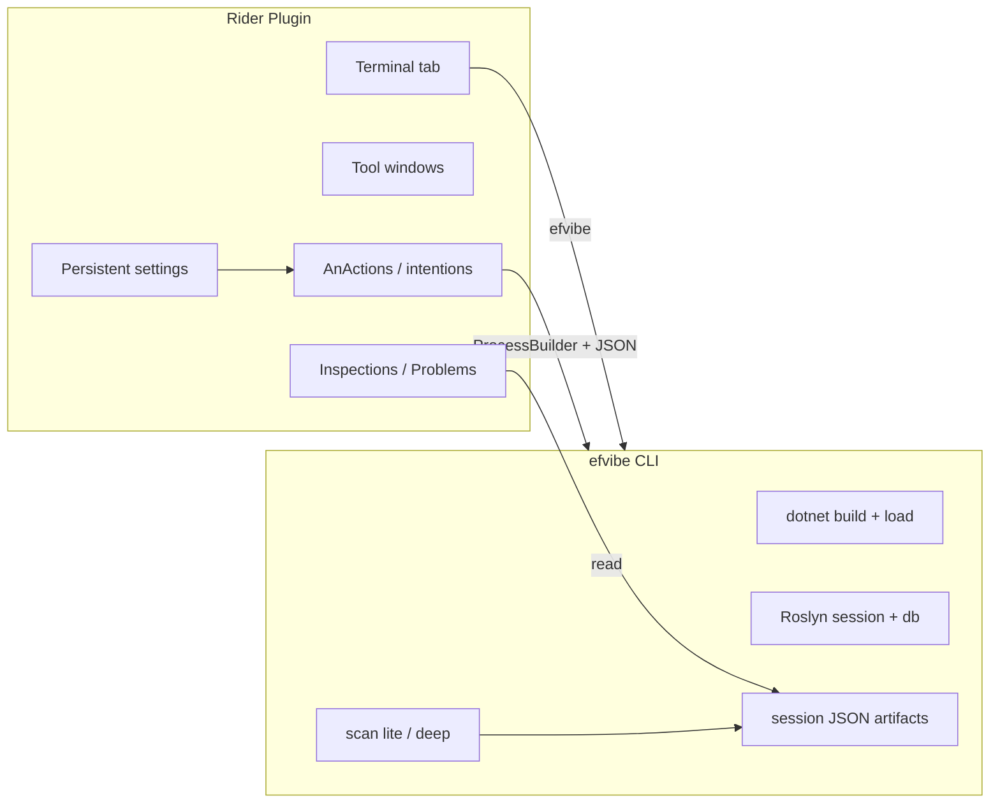

# JetBrains Rider extension plan for My EF Vibe (efvibe)

A Rider plugin should deliver the same workflow as the VS Code extension: **LINQ exploration, SQL visibility, scan findings, and REPL** inside the IDE, with **efvibe as the engine**. Rider is the primary JetBrains surface for .NET; the plugin is orchestration and UI — not a rewrite of MyEfVibe.

## Vision

**EF Core LINQ in Rider** — gutter or context menu on a `.cs` file, run a query against the real `DbContext`, see SQL and results in a **tool window** beside the editor, and surface `:scan` findings as **inspections** or **Problems**. Target users: cross-platform .NET teams (macOS, Windows, Linux) using Rider instead of Visual Studio or VS Code.

## Architecture



| Layer | Responsibility |
|--------|----------------|
| **Rider plugin (Kotlin)** | Settings, actions, tool windows, inspections, terminal, parse JSON |
| **efvibe (C#)** | Build, DbContext, evaluation, scans — single source of truth |

**Principle:** Subprocess + JSON in v1 (same as VS Code). Rider’s Roslyn layer is **not** used to evaluate LINQ in-process — avoids version skew with user’s EF Core packages.

**Optional later:** ReSharper-based inspections that call the same JSON scan artifacts (shared backend, different frontend).

## IDE surface map (target)

| efvibe capability | Rider surface |
|-------------------|---------------|
| REPL `db` | **Terminal** tool window tab “My EF Vibe” |
| `-e` one-shot | **Run with My EF Vibe** (editor popup, gutter icon on LINQ) |
| Editable re-run + `:plan` | **My EF Vibe** tool window: expression editor, Run / Run plan, read-only guard |
| `:scan lite` / `:scan deep` | **Problems** tool window via `LocalInspectionTool` or daemon after headless scan |
| Review queue | Dedicated **Scan Review** tool window (table: file, rule, SQL, dismiss) |
| `:plan` | Tool window section (`--with-plan`) |
| `:tables` / `:describe` | Tool window tree (Phase 3; needs CLI JSON) |
| Settings | **Settings → Languages & Frameworks → My EF Vibe** (`Configurable` + `PersistentStateComponent`) |
| Run configuration | Optional **My EF Vibe REPL** run config type |

## Technology choices

| Option | Recommendation |
|--------|----------------|
| **IntelliJ Platform plugin (Kotlin)** | Primary — official Rider plugin path; works on Rider only with `com.intellij.modules.rider` dependency |
| **Gradle + intellij-platform Gradle plugin** | Build and run sandbox Rider |
| **ReSharper SDK plugin** | Secondary — only if deep C# PSI integration required; higher cost |
| **Shared core library** | v2: extract JSON + path rules to small Kotlin/JVM or call `efvibe --about-json` only |

**Target Rider versions:** Current major (e.g. 2024.3+) with `sinceBuild` / `untilBuild` in `plugin.xml`.

**SDK:** `rider-sdk` or platform version aligned with [JetBrains Rider plugin docs](https://plugins.jetbrains.com/docs/intellij/rider.html).

## Phased roadmap

Aligned with [vscode-extension-plan.md](./vscode-extension-plan.md). VS Code Phase 0–1 is **done** — treat as behavioral spec.

### Phase 0 — Foundation (3–4 weeks)

**Goal:** Installable plugin that launches efvibe for the open solution.

| Item | Detail |
|------|--------|
| Plugin scaffold | `id=com.yeahbah.efvibe`; name **My EF Vibe** |
| `plugin.xml` | Actions, tool window stub, application configurable |
| Prerequisites | `dotnet` on PATH; resolve `efvibe` global / `dotnet-tools.json` local tool |
| Settings | Project path, startup project, DbContext, workspace root, tool path, db log |
| Solution paths | `SolutionManager.openSolutions` → base directory for `-p` / `-s` |
| **Start REPL** | `TerminalTabManager` → shell with `efvibe …` |
| Status widget | Status bar widget: DbContext + connection from `--about-json` |

**Port from:** `vscode-extension/src/config.ts`, `cliRunner.ts`, `sessionPaths.ts`, `prerequisites.ts` → Kotlin services.

### Phase 1 — Editor-integrated queries (5–7 weeks)

**Goal:** Parity with VS Code v0.2.1 interactive result panel.

| Feature | Behavior |
|---------|----------|
| **Run selection / line / statement** | `AnAction` on `PsiFile` (C#); prefer `efvibe serve` daemon (same JSON protocol as VS Code), fallback to one-shot `-e` |
| **Repository snippets** | CLI `RepositorySnippetAdapter` |
| **Result tool window** | `SimpleToolWindowPanel` or JCEF for HTML table; expression `JTextArea`, **Run**, **Run :plan** |
| **Read-only guard** | Kotlin port of `expressionGuard.ts` before `GeneralCommandLine` |
| **Show last SQL** | Action + tool window SQL tab |
| **Keyboard shortcut** | Default **Ctrl+Alt+E** / **⌥⌘E** (configurable) |

**CLI:** `--format json`, `--no-banner`, `--with-plan`, `--about-json` (all shipped).

### Phase 2 — Scan in the IDE (5–6 weeks)

**Goal:** Scan findings as first-class problems.

| Feature | Behavior |
|---------|----------|
| **Scan solution** | Background task: `efvibe scan lite|deep` headless |
| **Inspections** | `LocalInspectionTool` registered for C#; highlights from scan JSON |
| **Problems view** | Standard IntelliJ problem presentation |
| **Quick fixes** | “Open in My EF Vibe REPL”, “Dismiss”, “Add note” (when CLI supports) |
| **Refresh** | `VirtualFileListener` on `myefvibe-scan-*.json` in session dir |

**CLI gaps:** Same as VS Code — headless scan, dismiss/note subcommands.

### Phase 3 — Rich experience (6+ weeks)

| Feature | Rider surface |
|---------|---------------|
| **db. completion** | Optional `efvibe language-server` + LSP4IJ |
| **Database tool window integration** | Link to Rider’s Database panel (read-only; no duplicate connection) |
| **EF entity tree** | Tool window from `--schema-json` |
| **Charts** | JCEF or inline `:chart` export viewer |
| **Unit test gutter** | Run fixture query from test method (stretch) |

**Recommendation:** Ship terminal + tool window first; LSP when adoption justifies maintenance.

## Configuration model

**Settings → Languages & Frameworks → My EF Vibe**

| Setting | Maps to CLI |
|---------|-------------|
| EF project (file chooser) | `-p` |
| Startup project | `-s` |
| DbContext | `-c` |
| Workspace root | `-w` |
| efvibe executable | `toolPath` |
| Enable database log | `--dblog` / `--no-dblog` |
| Show results in | Tool window / Services / Terminal |

**Per-project:** `.idea/efvibe.xml` or `efvibe.xml` under `.idea` (optional, gitignored) — Rider convention.

**Directory-based settings:** Support `efvibe.xml` in solution root for teams that commit shared paths (without secrets).

## Repository layout (proposed)

```
my-ef-vibe/
  src/MyEfVibe/
  vscode-extension/                 # reference ✅
  rider-extension/
    build.gradle.kts
    gradle.properties                 # platformVersion, riderVersion
    src/main/
      kotlin/com/yeahbah/efvibe/
        EfvibePlugin.kt
        actions/
          StartReplAction.kt
          RunSelectionAction.kt
        toolwindow/
          ResultToolWindowFactory.kt
        services/
          CliRunner.kt
          ExpressionGuard.kt
          EfvibeSettings.kt
        inspection/
          EfvibeScanInspection.kt
      resources/
        META-INF/plugin.xml
        icons/icon.png                # shared unicorn logo
  docs/
    rider-extension-plan.md
```

**Distribution:** [JetBrains Marketplace](https://plugins.jetbrains.com/) — plugin id `com.yeahbah.efvibe`.

## UX flows

### Flow 1 — First open

1. Open solution with EF Core projects.
2. Notification: **Configure My EF Vibe** → file choosers for `.csproj`, DbContext name.
3. Persist to project-level settings.
4. **Start REPL** opens terminal tab.

### Flow 2 — Debug a repository query

1. Select LINQ in repository/handler.
2. **Run with My EF Vibe** (gutter or **Alt+Enter** intention).
3. Tool window: tweak parameters, **Run**, **Run :plan**.

### Flow 3 — Scan-driven refactor

1. **Tools → My EF Vibe → Scan solution (deep)**.
2. Problems view lists findings; navigate to source.
3. Dismiss / note synced via session JSON + future CLI commands.

## Parity matrix (VS Code → Rider)

| VS Code (shipped) | Rider (planned) |
|-------------------|-----------------|
| Integrated terminal REPL | Terminal tab |
| Run selection / line / statement | Editor actions + shortcuts |
| Split result webview | Docked tool window |
| Editable expression + guard | Same semantics |
| `--with-plan` | Run plan action |
| Status bar | Status bar widget |
| Phase 2 diagnostics | Inspections + Problems |

## Rider-specific advantages

| Advantage | Use |
|-----------|-----|
| Built-in database tools | Link “open connection” docs only — efvibe uses real `DbContext`, not JDBC |
| Strong C# PSI | Future: statement expansion without regex |
| Cross-platform | Same plugin macOS / Windows / Linux |
| Gradle CI | `runIde` for automated UI tests (optional) |

## Risks and mitigations

| Risk | Mitigation |
|------|------------|
| Platform version churn | Pin `platformVersion`; update quarterly |
| PSI vs raw selection | v1: raw selection like VS Code; v2: PSI statement range |
| Process spawn on EDT | `ProgressManager.run(Process)` with cancellation |
| Long `dotnet build` | Background task + cancel button |
| Tool path on macOS | Document `efvibe` in PATH; `toolPath` setting for local `myefvibe` |

## Required CLI evolution (shared)

Same contract as VS Code — see [vscode-extension-plan.md](./vscode-extension-plan.md#required-cli-evolution-summary).

| Priority | Change | Unblocks Rider |
|----------|--------|----------------|
| P0 | `--about-json` ✅ | Status widget |
| P1 | `-e --format json` ✅ | Run selection |
| P1 | `--with-plan` ✅ | Plan panel |
| P1 | Headless `scan` | Inspections |
| P2 | `scan dismiss` / `note` | Quick fixes |
| P3 | `--schema-json` | Entity tree tool window |

## Success metrics

- Install plugin in Rider → first `db.*` evaluation in under 5 minutes.
- Scan findings visible in Problems without REPL review queue.
- Phase 1 parity with VS Code extension before Marketplace publish.

## Suggested implementation order

1. Phase 0 — plugin skeleton, settings, Start REPL, prerequisites.
2. Phase 1 — Run selection, result tool window (port guard + panel UX).
3. Phase 2 — scan inspections from JSON.
4. Phase 3 — schema tree, LSP, Database tool window links.

## Comparison: Visual Studio vs Rider vs VS Code

| Aspect | VS Code | Visual Studio | Rider |
|--------|---------|---------------|-------|
| Language | TypeScript | C# | Kotlin |
| Result UI | Webview | WPF tool window | Swing / JCEF |
| Diagnostics | Problems panel | Error List | Inspections |
| REPL host | Integrated terminal | Terminal | Terminal tab |
| Settings | `settings.json` | Tools → Options | Settings UI |
| Marketplace | Open VSX / VS Marketplace | VS Marketplace | JetBrains Marketplace |
| **Engine** | **efvibe CLI** | **efvibe CLI** | **efvibe CLI** |

All three should share: JSON evaluation shape, scan JSON files, session path rules, and icon/branding (**My EF Vibe** / `efvibe` CLI).

## Related docs

- [vscode-extension-plan.md](./vscode-extension-plan.md) — reference implementation
- [visual-studio-extension-plan.md](./visual-studio-extension-plan.md) — Windows VS plan
- [features.md](../features.md) — REPL and scan behavior
- [vscode-extension/README.md](../vscode-extension/README.md) — shipped commands
