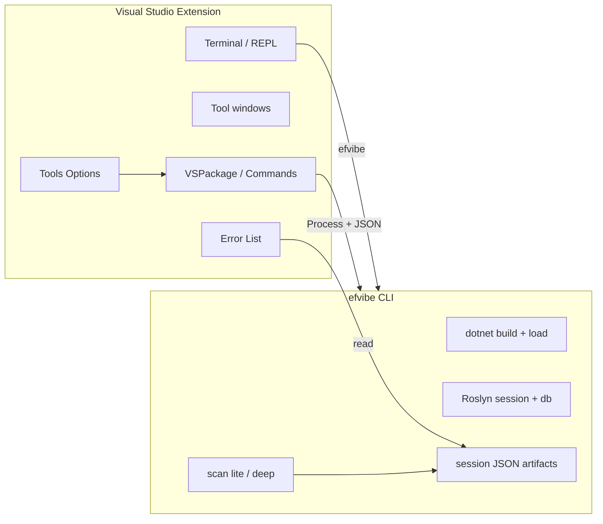

# Visual Studio extension plan for My EF Vibe (efvibe)

A Visual Studio extension should deliver the same workflow as the VS Code extension: **LINQ exploration, SQL visibility, scan findings, and REPL** inside the IDE, with **efvibe as the engine** (build, DbContext activation, Roslyn, EF). The extension is orchestration and UI on top of the existing CLI — not a second implementation of MyEfVibe.

## Vision

**EF Core LINQ in Visual Studio** — open a `.cs` file, run a query against the real `DbContext`, see SQL and results in a tool window beside the editor, and surface `:scan` findings in the **Error List**. Target users: teams on full Visual Studio (Windows), persistence + API split, design-time factories, user secrets, multi-`DbContext` solutions.

## Architecture



| Layer | Responsibility |
|--------|----------------|
| **VS extension (C#)** | Settings, menus, tool windows, Error List, terminal launch, spawn `efvibe`, parse JSON |
| **efvibe (C#)** | Build, DbContext, evaluation, scans, exports — single source of truth |

**Principle:** Same as VS Code — **subprocess + JSON** in v1. Do not host MyEfVibe inside devenv.exe. Share CLI contracts (`--format json`, `--about-json`, `--with-plan`, scan JSON files) across all editors.

## IDE surface map (target)

| efvibe capability | Visual Studio surface |
|-------------------|------------------------|
| REPL `db` | **View → Terminal** or custom tool window hosting `efvibe` |
| `-e` one-shot | Context menu **Run with My EF Vibe**; default keybinding |
| Editable re-run + `:plan` | **My EF Vibe Result** tool window (WPF): expression editor, Run / Run plan, read-only guard |
| `:scan lite` / `:scan deep` | **Error List** (Custom columns: Rule, Recommendation); optional **CodeLens**-style adornments via `IWpfTextViewMargin` |
| Review queue | Tool window **Scan Review** or Error List navigation |
| `:plan` | Result tool window section (via `--with-plan`) |
| Session artifacts | **Solution Explorer** special node or link in tool window |
| Settings | **Tools → Options → My EF Vibe** (`DialogPage`) + optional `.vs/MyEfVibe.json` per solution |

## Technology choices

| Option | Recommendation |
|--------|----------------|
| **VSIX + VSPackage (VS 2022+)** | Primary path — mature SDK, C# matches team and CLI |
| **VisualStudio.Extensibility (new API)** | Evaluate for greenfield; may lag VS Code feature parity |
| **ReSharper plugin** | Only if JetBrains partnership needed; Rider plan covers JetBrains stack |

**Target:** Visual Studio 2022 (17.x) minimum; align with .NET 8 / 9 / 10 workloads used by efvibe.

**Project template:** VSIX Project → Package → commands registered in `.vsct` + `AsyncPackage`.

## Phased roadmap

Phases mirror [vscode-extension-plan.md](./vscode-extension-plan.md). VS Code Phase 0–1 is **done**; use it as the behavioral spec.

### Phase 0 — Foundation (3–4 weeks)

**Goal:** Installable VSIX that launches efvibe correctly for the active solution.

| Item | Detail |
|------|--------|
| VSIX scaffold | Publisher `efvibe`; extension id `MyEfVibe.VisualStudio` |
| Prerequisite check | .NET SDK; global/local `dotnet tool` / `efvibe` on PATH |
| Options page | `EfProject`, `StartupProject`, `DbContext`, `WorkspaceRoot`, `ToolPath`, `ConnectionString`, `Provider` |
| Active solution | Resolve paths from `DTE.Solution`; cwd = solution directory |
| Command: **Start REPL** | Start terminal with `efvibe -p … -s … -c …` |
| Command: **Check prerequisites** | Output window pane “My EF Vibe” |
| Status bar | `IVsStatusbar` — DbContext name from `--about-json` |

**Reuse from repo:** Port logic concepts from `vscode-extension/src/config.ts`, `cliRunner.ts`, `sessionPaths.ts`, `prerequisites.ts` to C# (or thin shared doc — no shared binary in v1).

### Phase 1 — Editor-integrated queries (5–7 weeks)

**Goal:** Parity with VS Code v0.2.1 result panel.

| Feature | Behavior |
|---------|----------|
| **Run selection / line / statement** | Editor context menu + `OleMenuCommand`; spawn `efvibe -e --format json --no-banner` |
| **Repository snippets** | Rely on CLI `RepositorySnippetAdapter` (no VS-specific rewrite) |
| **Result tool window** | WPF: editable expression, **Run**, **Run :plan** (`--with-plan`), results grid, SQL blocks |
| **Read-only guard** | Block `SaveChanges`, `Add`/`Update`/`Remove`, `ExecuteSql`, destructive SQL before spawn (mirror `expressionGuard.ts`) |
| **Show last SQL** | Command reads last evaluation payload |
| **Generate launch profile** | Optional: write `.vs/MyEfVibe/launch.json` or document manual Options |

**CLI dependencies (already in repo):** `--format json`, `--no-banner`, `--with-plan`, `--about-json`.

### Phase 2 — Scan in the IDE (5–6 weeks)

**Goal:** `:scan lite` / `:scan deep` as Error List entries.

| Feature | Behavior |
|---------|----------|
| **Scan solution** | `efvibe scan lite|deep` headless + JSON to session folder |
| **Error List** | `CreateProvider` / `IVsErrorList` — map `filePath`, `line`, `ruleId`, `message`, `recommendation` |
| **Navigation** | Double-click → open document at line |
| **Dismiss / note** | Commands update `myefvibe-scan-dismissals.json` / notes (CLI subcommands when added) |
| **Refresh** | `FileSystemWatcher` on session scan JSON |

**CLI gaps (shared with VS Code):** `scan --non-interactive`, `scan dismiss|note` CLI, stable rule-id doc URLs.

### Phase 3 — Rich experience (6+ weeks)

| Feature | VS surface |
|---------|------------|
| **EF Model tree** | Tool window: `:tables` / `:describe` via CLI JSON (new `--schema-json` flag) |
| **IntelliSense on `db.`** | Optional long-running `efvibe language-server` + Roslyn completion bridge (high effort) |
| **Query plan visualizer** | Enhanced grid for `--with-plan` output |
| **Charts** | Host `:chart` output in tool window (WebView2) |

**Recommendation:** Terminal REPL + tool windows first; LSP last.

## Configuration model

**Tools → Options → My EF Vibe** (user-scoped defaults):

| Setting | Maps to CLI |
|---------|-------------|
| EF project path | `-p` |
| Startup project | `-s` |
| DbContext | `-c` |
| Workspace root | `-w` |
| Tool path | override `efvibe` / `myefvibe` |
| Db log | `--dblog` / `--no-dblog` |
| Result destination | Tool window vs Output window |

**Per-solution (optional v2):** `.vs/MyEfVibe/settings.json` checked into `.gitignore` by default; wizard on first use picks `.csproj` from solution.

**Multi-project solutions:** Command **Select My EF Vibe profile** — pick startup + persistence project (reuse CLI discovery heuristics later).

## Repository layout (proposed)

```
my-ef-vibe/
  src/MyEfVibe/                    # existing CLI
  vscode-extension/                # reference implementation ✅
  visualstudio-extension/
    MyEfVibe.VisualStudio.sln
    MyEfVibe.VisualStudio/
      MyEfVibePackage.cs           # AsyncPackage
      Commands/
      ToolWindows/
        ResultToolWindow.cs
        ResultControl.xaml
      Options/
        EfvibeOptionsPage.cs
      Services/
        CliRunner.cs
        ExpressionGuard.cs
        SessionPaths.cs
      source.extension.vsixmanifest
  docs/
    visual-studio-extension-plan.md
```

**Distribution:** Visual Studio Marketplace — `My EF Vibe` display name, unicorn icon shared with VS Code.

## UX flows

### Flow 1 — First open

1. Developer opens a solution with EF projects.
2. Extension prompts **Configure My EF Vibe** → pick persistence + startup `.csproj`, DbContext.
3. Writes Tools Options (and optional `.vs/MyEfVibe/settings.json`).
4. **Start REPL** opens terminal; user sees session path in output.

### Flow 2 — Debug a repository query

1. Select handler LINQ in a `.cs` file.
2. **Run with My EF Vibe** → CLI adapts snippet → JSON.
3. **My EF Vibe Result** tool window: edit `entraObjectId` stub values, **Run**, **Run :plan**.

### Flow 3 — Scan-driven refactor

1. **Scan solution (deep)** from main menu.
2. Error List populates; fix N+1; dismiss false positives.
3. Re-scan; shared JSON with CLI REPL.

## Parity matrix (VS Code → Visual Studio)

| VS Code (shipped) | Visual Studio (planned) |
|-------------------|-------------------------|
| `efvibe.startRepl` | Start REPL |
| `efvibe.runSelection` / line / statement | Editor commands |
| Result webview + editable expr | WPF tool window |
| `expressionGuard` | Pre-spawn validation |
| `--with-plan` | Run plan button |
| `efvibe.refreshStatus` | Status bar + about JSON |
| Phase 2 diagnostics | Error List |

## Risks and mitigations

| Risk | Mitigation |
|------|------------|
| VS SDK complexity / versioning | Pin VS SDK 17.x; CI build with `msbuild` + VSSDK |
| Async package deadlocks | `JoinableTaskFactory` for UI thread marshaling |
| Different cwd than CLI | Always pass absolute `-p` / `-s`; solution directory as cwd |
| Terminal not installed | Fall back to Output window + `efvibe -e` only |
| Long builds block UI | Progress dialog; optional `--no-build` when CLI supports it |

## Required CLI evolution (shared)

See [vscode-extension-plan.md — Required CLI evolution](./vscode-extension-plan.md#required-cli-evolution-summary). Visual Studio does not need separate JSON formats — **one contract for all IDEs**.

| Priority | Change | Unblocks VS |
|----------|--------|-------------|
| P0 | `--about-json` ✅ | Status bar |
| P1 | `-e --format json` ✅ | Run selection |
| P1 | `--with-plan` ✅ | Plan in tool window |
| P1 | Headless `scan` | Error List |
| P2 | `scan dismiss` / `note` | Dismiss from IDE |
| P3 | `--schema-json` | EF Model tool window |

## Success metrics

- Install VSIX → first successful `db.*` evaluation in under 5 minutes (with sample solution).
- Error List shows scan findings without opening REPL review queue.
- Feature parity checklist vs VS Code Phase 1 ≥ 90% before Marketplace publish.

## Suggested implementation order

1. Phase 0 — VSIX, Options, Start REPL, prerequisites, status bar.
2. Phase 1 — Run selection, result tool window (port `resultPanel` + `expressionGuard` behavior).
3. Phase 2 — Error List diagnostics from scan JSON.
4. Phase 3 — Schema tree, plan visualization, optional LSP.

## Related docs

- [vscode-extension-plan.md](./vscode-extension-plan.md) — reference implementation and CLI contracts
- [rider-extension-plan.md](./rider-extension-plan.md) — JetBrains IDE plan
- [features.md](../features.md) — REPL commands and session layout
- [vscode-extension/README.md](../vscode-extension/README.md) — shipped VS Code commands and settings
