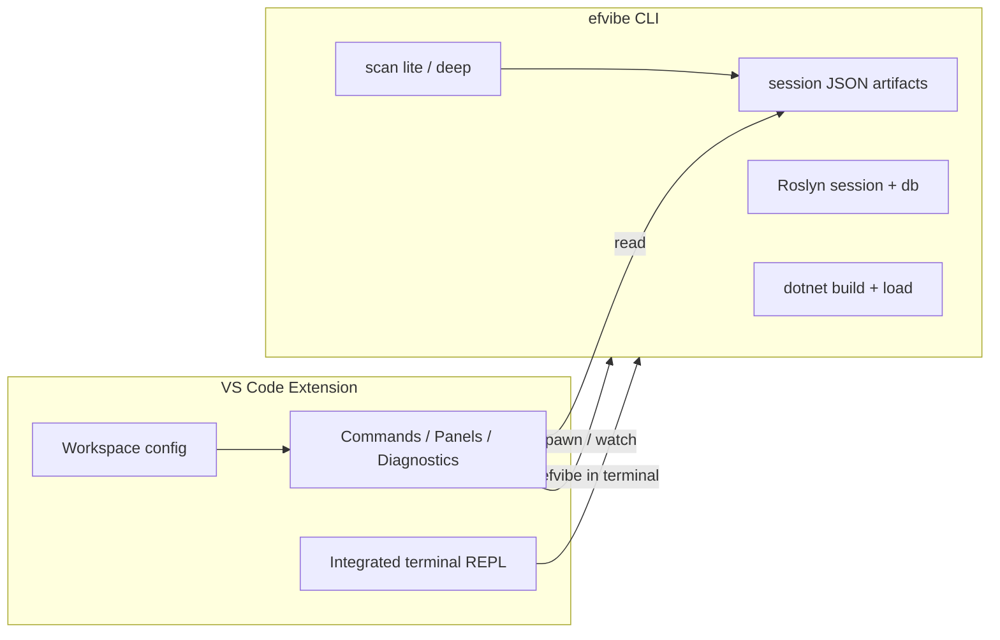

# VS Code extension plan for efvibe

A VS Code extension should make **LINQ exploration, SQL visibility, and scan findings** native in the editor, while **efvibe remains the engine** (build, DbContext activation, Roslyn, EF). The extension is primarily orchestration and UI, not a rewrite of MyEfVibe.

## Vision

**EF Core LINQ in the editor** — open a `.cs` file, run a query against the real `DbContext`, see SQL and results beside your code, and surface `:scan` findings as diagnostics without leaving VS Code.

Target users match today’s CLI users: persistence + API split, design-time factories, user secrets, multi-`DbContext` solutions.

## Architecture



| Layer | Responsibility |
|--------|----------------|
| **Extension (TypeScript)** | Settings, project discovery UI, terminal/tasks, diagnostics, webviews, editor actions |
| **efvibe (C#)** | Build, DbContext construction, evaluation, scans, exports — single source of truth |

**Principle:** Prefer **subprocess + JSON files** in v1 over embedding .NET in the extension. Add a **machine protocol** only when terminal scraping becomes painful.

## Phased roadmap

### Phase 0 — Foundation (2–3 weeks) ✅ implemented in `vscode-extension/`

**Goal:** Installable extension that launches efvibe correctly for a .NET workspace.

| Item | Detail |
|------|--------|
| Extension scaffold | `efvibe` publisher id; `package.json` contributes commands and configuration |
| Prerequisite check | .NET SDK on PATH; `efvibe` global or local tool (`dotnet tool restore`) |
| Settings | `efvibe.workspaceRoot`, `efvibe.project`, `efvibe.startupProject`, `efvibe.context`, `efvibe.connectionString`, `efvibe.provider`, `efvibe.toolPath` |
| Resolve session path | Mirror CLI: `{workspaceRoot}/{ProjectName}/{DbContextName}/` |
| Command: Start REPL | Opens integrated terminal with resolved `efvibe` flags from settings and workspace folder |
| Command: Run expression | `efvibe -e "..."` in terminal or output channel |
| Status bar | DbContext name; connection state (from structured CLI output when available) |

**CLI gaps to close (small):**

- `--version` / `--about-json` — session metadata without parsing Spectre markup (`--about-json` added)
- Consistent non-zero exit codes on build / DbContext failure (existing: 1 parse, 3 provider, 10 workspace, 14 DbContext)

### Phase 1 — Editor-integrated queries (4–6 weeks) ✅ implemented in `vscode-extension/` v0.2.0

**Goal:** Run LINQ from the editor without manually typing in the terminal.

| Feature | Behavior |
|---------|----------|
| Run selection / line | Context menu → `efvibe -e --format json`; result in webview panel or output channel |
| Run at cursor | Statement expansion + `dbContext` → `db` alias rewrite (CLI `SnippetNormalizer`) |
| SQL panel | Webview shows executed/translated SQL from JSON payload |
| Launch config | **efvibe: Generate REPL Task** writes `.vscode/tasks.json` shell task |

**CLI gaps (closed in repo):**

- `--format json` / `--no-banner` on `-e` — one-shot evaluation result, for example:

```json
{
  "success": true,
  "value": "...",
  "sql": ["..."],
  "metrics": { "totalMs": 12, "rowCount": 5 },
  "warnings": []
}
```

- Optional `--no-banner` for clean parsing

### Phase 2 — Scan in the editor (4–5 weeks)

**Goal:** `:scan lite` / `:scan deep` as first-class IDE diagnostics.

efvibe already writes under the session folder:

- `myefvibe-scan-lite.json` / `myefvibe-scan-deep.json`
- `myefvibe-scan-dismissals.json`, `myefvibe-scan-notes.json`

| Feature | Behavior |
|---------|----------|
| Scan workspace command | Batch mode (new flag) writes JSON under session dir |
| Problems panel | Findings → `vscode.Diagnostic` (file, line, rule id as `code`, recommendation in `relatedInformation`) |
| CodeLens | “efvibe: N+1 risk” / “View SQL” on deep-scan `query-site` lines |
| Hover | `translatedSql`, `sqlTranslationNote`, saved note from JSON |
| Dismiss / note | Commands update same JSON stores as CLI (`:dismiss`, `:note`) |
| Watch | `FileSystemWatcher` on scan JSON → refresh diagnostics after REPL scan |

**CLI gaps:**

- `efvibe scan lite|deep --non-interactive` (no REPL; exit 0/1; write JSON only)
- `efvibe scan dismiss|note` subcommands for extension parity
- Stable **rule id → docs URL** map for “Learn more” in hovers

### Phase 3 — Rich REPL experience (6+ weeks)

**Goal:** Optional upgrade beyond terminal-only.

| Option | Tradeoff |
|--------|----------|
| **A. Custom editor (Notebook / Webview)** | Multi-cell LINQ, `;` submit, Shift+Enter newline — duplicates REPL UX; high effort |
| **B. Language Server (LSP)** | Completion on `db.`, entity types — needs long-running `efvibe language-server` |
| **C. Terminal enhancements only** | Keybindings for submit — low effort; keeps one REPL |

**Recommendation:** Ship **C** in v1; prototype **B** only if terminal completion is insufficient.

| Feature | Phase |
|---------|--------|
| Completion via LSP | 3B |
| Entity picker (`:describe` data) in Quick Pick | 3A-lite |
| Schema explorer tree (`:tables`, `:dbinfo`) | Webview sidebar |
| Query plan viewer (`:plan`) | Webview |
| Compare / benchmark from last run | Webview charts (CLI already has `:chart`) |

## VS Code feature map (full target)

| efvibe capability | VS Code surface |
|-------------------|-----------------|
| REPL `db` | Integrated terminal; optional notebook |
| `-e` one-shot | Run selection; CodeLens “Evaluate” |
| `:sql` | Setting; status bar toggle |
| `:tables` / `:describe` | Sidebar “EF Model” tree |
| `:dbinfo` | Settings page; status bar tooltip |
| `:scan lite` / `:scan deep` | Diagnostics; scan explorer view |
| Review queue (`:next`, dismiss, note) | Problems panel; “Scan Review” webview |
| `:plan` | Webview or peek on last SQL |
| `:export csv` / `:export json` | Command → save dialog under session folder |
| Session artifacts | Explorer: “efvibe Session” |

## Configuration model

```jsonc
// .vscode/settings.json or user settings
{
  "efvibe.workspaceRoot": "${userHome}/.efvibe",
  "efvibe.project": "${workspaceFolder}/src/MyApp.Persistence/MyApp.Persistence.csproj",
  "efvibe.startupProject": "${workspaceFolder}/src/MyApp.Api/MyApp.Api.csproj",
  "efvibe.context": "MyApp.Persistence.AppDbContext",
  "efvibe.showSql": true,
  "efvibe.scan.onSave": false,
  "efvibe.scan.mode": "lite"
}
```

**Multi-root:** One active “efvibe profile” per folder; command palette “Select efvibe project” when ambiguous (reuse CLI scoring later).

**Local tool:** Detect `dotnet-tools.json` and prefer `dotnet efvibe` over global install.

## Repository layout (proposed)

```
my-ef-vibe/
  src/MyEfVibe/              # existing CLI
  vscode-extension/
    package.json
    src/
      extension.ts
      cliRunner.ts             # spawn efvibe, parse JSON
      sessionPaths.ts          # mirror SessionPaths rules
      diagnostics.ts           # scan JSON → DiagnosticCollection
      config.ts
  docs/
    vscode-extension-plan.md   # this document
```

Publish as **`efvibe.vscode-efvibe`** on Open VSX and the Visual Studio Marketplace.

## Required CLI evolution (summary)

| Priority | Change | Unblocks |
|----------|--------|----------|
| P0 | `--version`, clear exit codes | Extension health checks |
| P1 | `-e --format json` ✅ | Run selection; results panel |
| P1 | `scan --no-repl` / headless scan | CI; editor diagnostics |
| P2 | `scan dismiss` / `scan note` CLI | Editor actions without REPL |
| P2 | `--about-json` (context, paths, provider) | Status bar; tree labels |
| P3 | `efvibe language-server` (optional) | `db.` IntelliSense in editor |

Keep **JSON schemas versioned** (scan documents already expose a `version` field).

### Scan JSON shape (existing)

The extension can consume today’s scan files without waiting for new formats. Each finding includes:

| Field | Use in VS Code |
|-------|----------------|
| `filePath`, `line` | Diagnostic location |
| `ruleId`, `message` | Code and message |
| `recommendation` | Related information / fix hint |
| `translatedSql`, `sqlTranslationNote` | Hover (deep scan) |
| `savedNote` | Hover / badge |

## UX flows

### Flow 1 — First open

1. User opens a solution with EF projects.
2. Extension prompts “Configure efvibe” → pick `-p` and `-s` from discovered `.csproj` files.
3. Writes `.vscode/settings.json`.
4. “Start REPL” opens the terminal; banner shows session path.

### Flow 2 — Debug a query in a repository

1. User selects `return await dbContext.Orders.Where(...).ToListAsync();`
2. **Run with efvibe** adapts `dbContext` → `db`, runs, returns JSON.
3. Editor shows result rows, SQL tab, and warnings.

### Flow 3 — Scan-driven refactor

1. **Scan workspace (deep)** from the command palette.
2. Problems panel lists findings; user fixes N+1, dismisses false positives.
3. Re-scan; dismissals persist via shared JSON with the CLI.

## Risks and mitigations

| Risk | Mitigation |
|------|------------|
| Parsing Spectre terminal output | Do not rely on it — use JSON flags only |
| DbContext resolution differs by cwd | Always pass absolute `-p` / `-s`; cwd = solution root |
| Deep scan misses repository indirection | Document limits; “Open in REPL” with manual snippet |
| Long `dotnet build` every run | Cache build fingerprint; optional `--no-build` when output is fresh |
| Secrets in committed settings | Never write connection strings to repo settings; user secrets only |
| Windows line endings in REPL | Handled in CLI (`InputLineUtilities`); extension uses JSON, not terminal parsing |

## Success metrics

- Time from clone → first successful `db.*` query in VS Code under 5 minutes (with docs).
- Scan findings visible in Problems without manually running the REPL review queue.
- Majority of one-shot runs use JSON output, not log scraping.

## Suggested implementation order

1. Phase 0 extension + REPL terminal command.
2. CLI: `--format json` for `-e` and headless `scan`.
3. Phase 2 diagnostics (highest unique value vs terminal alone).
4. Phase 1 run selection.
5. Phase 3 sidebar and LSP only if adoption warrants it.

## Related docs

- [features.md](../features.md) — REPL commands, scan behavior, session layout
- [linq-scan-feasibility.md](./linq-scan-feasibility.md) — scan rules and deep-scan limitations
