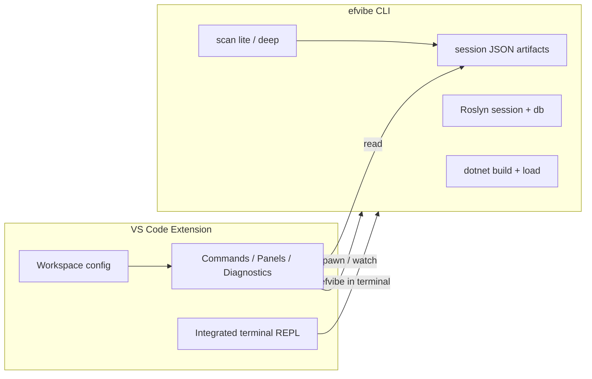

# VS Code extension plan for efvibe

A VS Code extension should make **LINQ exploration, SQL visibility, and scan findings** native in the editor, while **efvibe remains the engine** (build, DbContext activation, Roslyn, EF). The extension is primarily orchestration and UI, not a rewrite of MyEfVibe.

## Vision

**EF Core LINQ in the editor** — open a `.cs` file, run a query against the real `DbContext`, see SQL and results beside your code, and surface `:scan` findings as diagnostics without leaving VS Code.

Target users match today’s CLI users: persistence + API split, design-time factories, user secrets, multi-`DbContext` solutions.

## Architecture



| Layer | Responsibility |
|--------|----------------|
| **Extension (TypeScript)** | Settings, project discovery UI, terminal/tasks, diagnostics, webviews, editor actions |
| **efvibe (C#)** | Build, DbContext construction, evaluation, scans, exports — single source of truth |

**Principle:** Prefer **subprocess + JSON files** in v1 over embedding .NET in the extension. Add a **machine protocol** only when terminal scraping becomes painful.

## Phased roadmap

### Phase 0 — Foundation (2–3 weeks) ✅ implemented in `vscode-extension/`

**Goal:** Installable extension that launches efvibe correctly for a .NET workspace.

| Item | Detail |
|------|--------|
| Extension scaffold | `efvibe` publisher id; `package.json` contributes commands and configuration |
| Prerequisite check | .NET SDK on PATH; `efvibe` global or local tool (`dotnet tool restore`) |
| Settings | `efvibe.workspaceRoot`, `efvibe.project`, `efvibe.startupProject`, `efvibe.context`, `efvibe.connectionString`, `efvibe.provider`, `efvibe.toolPath` |
| Resolve session path | Mirror CLI: `{workspaceRoot}/{ProjectName}/{DbContextName}/` |
| Command: Start REPL | Opens integrated terminal with resolved `efvibe` flags from settings and workspace folder |
| Command: Run expression | `efvibe -e "..."` in terminal or output channel |
| Status bar | DbContext name; connection state (from structured CLI output when available) |

**CLI gaps to close (small):**

- `--version` / `--about-json` — session metadata without parsing Spectre markup (`--about-json` added)
- Consistent non-zero exit codes on build / DbContext failure (existing: 1 parse, 3 provider, 10 workspace, 14 DbContext)

### Phase 1 — Editor-integrated queries (4–6 weeks) ✅ implemented in `vscode-extension/` v0.2.2

**Goal:** Run LINQ from the editor without manually typing in the terminal.

| Feature | Behavior |
|---------|----------|
| Run selection / line | `efvibe serve` daemon (default) or `efvibe -e --format json` fallback; split webview panel or output channel |
| Run at cursor | Statement expansion + repository snippet adapter (CLI `RepositorySnippetAdapter`) |
| Editable result panel | Edit expression (e.g. parameter stubs), **Run**, **Run :plan** (`--with-plan`); read-only guard blocks mutations |
| SQL panel | Webview beside editor shows executed/translated SQL from JSON payload |
| Launch config | **efvibe: Generate REPL Task** writes `.vscode/tasks.json` shell task |
| Settings | `efvibe.dbLog`, `efvibe.useDaemon` (default true), `efvibe.resultDestination` |

**CLI gaps (closed in repo):**

- `--format json` / `--no-banner` on `-e` — one-shot evaluation result, for example:

```json
{
  "success": true,
  "value": "...",
  "sql": ["..."],
  "metrics": { "totalMs": 12, "rowCount": 5 },
  "warnings": []
}
```

- Optional `--no-banner` for clean parsing

### Phase 2 — Scan in the editor (4–5 weeks) ✅ implemented in `vscode-extension/` v0.3.1

**Goal:** `:scan lite` / `:scan deep` as a first-class IDE review flow.

efvibe writes under the session folder:

- `myefvibe-scan-lite.json` / `myefvibe-scan-deep.json`
- `myefvibe-scan-dismissals.json`, `myefvibe-scan-notes.json`

| Feature | Behavior |
|---------|----------|
| Scan workspace command | `efvibe scan lite\|deep --json --no-banner` from **Scan Workspace** / **Scan Workspace (Deep)** |
| **Scan Review** tab | Carousel UI — one finding at a time, **Previous/Next**, clickable location, **Dismiss**, **Note**, **📋 copy** on code/SQL/plan |
| Optional Problems panel | `efvibe.scan.problemsPanel` (default `false`) — avoids C# LSP conflicts on squiggled lines |
| Watch | `FileSystemWatcher` on scan JSON → refresh review after REPL `:scan` |

**Deferred to Phase 2+ / Phase 3:**

- CodeLens on `query-site` lines
- `efvibe scan note` CLI subcommand (REPL `:note` only today)
- Stable **rule id → docs URL** map for “Learn more” in hovers

**CLI (closed in repo):**

- Headless `efvibe scan lite|deep` with `--json`, `--no-banner`, `--respect-dismissals`
- Public `ReplQueryableRuntime` for repository-snippet evaluation in Roslyn scripts

### Phase 3 — Rich REPL experience ✅ implemented in `vscode-extension/` v0.5.0

**Goal:** Optional upgrade beyond terminal-only.

| Feature | Status |
|---------|--------|
| `efvibe.scan.onSave` | ✅ Debounced scan on C# save |
| **EF Model** tree | ✅ Describe, Go To Definition, Run Query, Run Count |
| **Send to REPL** | ✅ |
| **`db.*` completion** | ✅ C# completion provider + `--completions-json` |
| **`efvibe language-server`** | ✅ Minimal LSP (initialize + completion) for other editors |
| **Entity picker** | ✅ **Pick Entity** command |
| **Query plan viewer** | ✅ **Show Query Plan** command + result panel **Run Plan** |
| **Compare / charts** | ✅ **Show Session Charts**, **Set Compare Baseline** |
| **CodeLens** | ✅ **Run with efvibe** on LINQ-like lines |
| **Scan rule docs** | ✅ Learn-more links in Scan Review + Problems related info |
| **`:dbinfo`** | ✅ **Show DbInfo** panel (`--dbinfo-json`) |
| **Session explorer** | ✅ **efvibe Session** sidebar (scan JSON, notes, exports) |
| **`efvibe scan note` / `dismiss`** | ✅ Headless CLI subcommands |

**CLI:** `--tables-json`, `--describe-json`, `--dbinfo-json`, `--completions-json`, `efvibe language-server`, `efvibe scan note|dismiss`.

**Phase 3A notebook:** ✅ MVP implemented. `.efvibe-notebook` files use VS Code's Notebook API with C# LINQ cells, markdown cells, an **efvibe** controller, and an **efvibe :plan** controller. Cell output keeps rows, SQL, metrics, warnings, and query plans with the cell; command cells currently support `:dbinfo` and `:tables`.

**Published:** [Visual Studio Marketplace](https://marketplace.visualstudio.com/items?itemName=yeahbah.vscode-efvibe) (`yeahbah.vscode-efvibe`) — search **`efvibe`**. Open VSX when `OVSX_PAT` is configured in CI.

## VS Code feature map (full target)

| efvibe capability | VS Code surface |
|-------------------|-----------------|
| REPL `db` | Integrated terminal; optional notebook |
| `-e` one-shot | Run selection; CodeLens “Evaluate” |
| `:sql` | Setting; status bar toggle |
| `:tables` / `:describe` | Sidebar “EF Model” tree |
| `:dbinfo` | Settings page; status bar tooltip |
| `:scan lite` / `:scan deep` | Diagnostics; scan explorer view |
| Review queue (`:next`, dismiss, note) | Problems panel; “Scan Review” webview |
| `:plan` | Webview or peek on last SQL |
| `:export csv` / `:export json` | Command → save dialog under session folder |
| Session artifacts | Explorer: “efvibe Session” |

## Configuration model

```jsonc
// .vscode/settings.json or user settings
{
  "efvibe.workspaceRoot": "${userHome}/.efvibe",
  "efvibe.project": "${workspaceFolder}/src/MyApp.Persistence/MyApp.Persistence.csproj",
  "efvibe.startupProject": "${workspaceFolder}/src/MyApp.Api/MyApp.Api.csproj",
  "efvibe.context": "MyApp.Persistence.AppDbContext",
  "efvibe.dbLog": true,
  "efvibe.scan.onSave": false,
  "efvibe.scan.mode": "lite"
}
```

**Multi-root:** One active “efvibe profile” per folder; command palette “Select efvibe project” when ambiguous (reuse CLI scoring later).

**Local tool:** Detect `dotnet-tools.json` and prefer `dotnet efvibe` over global install.

## Repository layout (proposed)

```
my-ef-vibe/
  src/MyEfVibe/              # existing CLI
  vscode-extension/
    package.json
    src/
      extension.ts
      cliRunner.ts             # spawn efvibe, parse JSON
      sessionPaths.ts          # mirror SessionPaths rules
      diagnostics.ts           # scan JSON → DiagnosticCollection
      config.ts
  docs/
    vscode-extension-plan.md   # this document
```

Published as **`yeahbah.vscode-efvibe`** on the [Visual Studio Marketplace](https://marketplace.visualstudio.com/items?itemName=yeahbah.vscode-efvibe) (search **`efvibe`**). Open VSX publish is optional via `OVSX_PAT` in CI.

## Required CLI evolution (summary)

| Priority | Change | Unblocks |
|----------|--------|----------|
| P0 | `--version`, clear exit codes | Extension health checks |
| P1 | `-e --format json` ✅ | Run selection; results panel |
| P1 | `efvibe serve` ✅ | Long-running daemon for fast editor eval (see [efvibe-daemon-and-vscode.md](./efvibe-daemon-and-vscode.md)) |
| P1 | `scan --no-repl` / headless scan | CI; editor diagnostics |
| P2 | `scan dismiss` / `scan note` CLI | Editor actions without REPL |
| P2 | `--about-json` (context, paths, provider) | Status bar; tree labels |
| P2 | `--tables-json` (DbSets, entity types) ✅ | EF Model sidebar |
| P3 | `efvibe language-server` (optional) | `db.` IntelliSense in editor |

Keep **JSON schemas versioned** (scan documents already expose a `version` field).

### Scan JSON shape (existing)

The extension can consume today’s scan files without waiting for new formats. Each finding includes:

| Field | Use in VS Code |
|-------|----------------|
| `filePath`, `line` | Diagnostic location |
| `ruleId`, `message` | Code and message |
| `recommendation` | Related information / fix hint |
| `translatedSql`, `sqlTranslationNote` | Hover (deep scan) |
| `savedNote` | Hover / badge |

## UX flows

### Flow 1 — First open

1. User opens a solution with EF projects.
2. Extension prompts “Configure efvibe” → pick `-p` and `-s` from discovered `.csproj` files.
3. Writes `.vscode/settings.json`.
4. “Start REPL” opens the terminal; banner shows session path.

### Flow 2 — Debug a query in a repository

1. User selects a multiline handler query (`await DbContext....FirstOrDefaultAsync(cancellationToken)`).
2. **Run Selection** sends the snippet to `efvibe serve` (or one-shot `efvibe -e --format json`); CLI strips `await`, rewrites `DbContext` → `db`, stubs parameters, converts async terminals to sync. User edits values in the panel and re-runs without a full rebuild.
3. Split webview shows result rows, SQL, and warnings (stubbed values — SQL shape, not production rows).

### Flow 3 — Scan-driven refactor

1. **Scan workspace (deep)** from the command palette.
2. Problems panel lists findings; user fixes N+1, dismisses false positives.
3. Re-scan; dismissals persist via shared JSON with the CLI.

## Risks and mitigations

| Risk | Mitigation |
|------|------------|
| Parsing Spectre terminal output | Do not rely on it — use JSON flags only |
| DbContext resolution differs by cwd | Always pass absolute `-p` / `-s`; cwd = solution root |
| Deep scan misses repository indirection | Document limits; “Open in REPL” with manual snippet |
| Long `dotnet build` every run | Cache build fingerprint; optional `--no-build` when output is fresh |
| Secrets in committed settings | Never write connection strings to repo settings; user secrets only |
| Windows line endings in REPL | Handled in CLI (`InputLineUtilities`); extension uses JSON, not terminal parsing |

## Success metrics

- Time from clone → first successful `db.*` query in VS Code under 5 minutes (with docs).
- Scan findings visible in Problems without manually running the REPL review queue.
- Majority of one-shot runs use JSON output, not log scraping.

## Suggested implementation order

1. Phase 0 extension + REPL terminal command.
2. CLI: `--format json` for `-e` and headless `scan`.
3. Phase 2 diagnostics (highest unique value vs terminal alone).
4. Phase 1 run selection.
5. Phase 3 sidebar and LSP only if adoption warrants it.

## Related docs

- [myefvibe.com](https://myefvibe.com/) — product site, getting started, CLI/REPL/scan/VS Code guides
- [visual-studio-extension-plan.md](./visual-studio-extension-plan.md) — Visual Studio 2022+ VSIX roadmap
- [rider-extension-plan.md](./rider-extension-plan.md) — JetBrains Rider plugin roadmap
- [features.md](../features.md) — REPL commands, scan behavior, session layout
- [linq-scan-feasibility.md](./linq-scan-feasibility.md) — scan rules and deep-scan limitations
